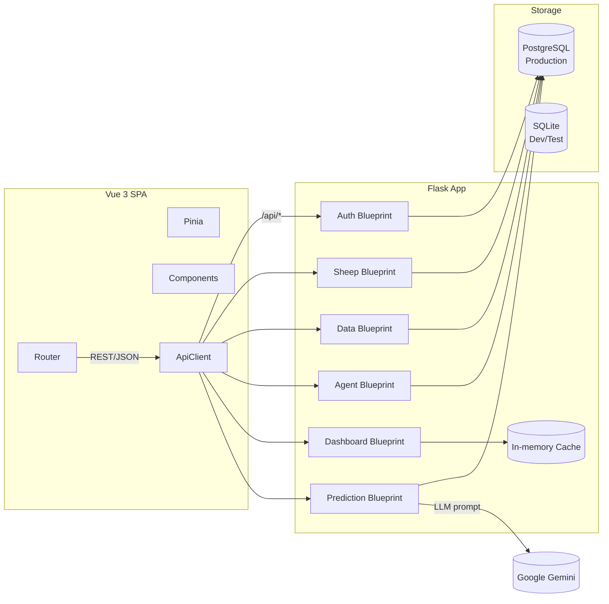

# 領頭羊博士（Goat Nutrition App）

> 智慧化山羊營養管理平台，結合 Flask 後端、Vue 3 前端、AI 輔助決策與 Excel 資料流程，協助牧場即時掌握羊群營養與 ESG 指標。

## 目錄

- [專案介紹](#專案介紹)
- [技術棧與核心模組](#技術棧與核心模組)
- [系統架構](#系統架構)
- [功能亮點](#功能亮點)
- [目錄結構](#目錄結構)
- [快速開始](#快速開始)
- [Docker Compose 部署](#docker-compose-部署)
- [測試與覆蓋率](#測試與覆蓋率)
- [API 概覽](#api-概覽)
- [開發工作流與最佳實務](#開發工作流與最佳實務)
- [文件地圖](#文件地圖)
- [常見問題 FAQ](#常見問題-faq)
## 專案介紹

- **定位**：提供羊隻資料管理、AI 營養諮詢、生長預測與儀表板分析的一站式解決方案。
- **特色**：
	- 紀錄羊隻基本、事件、歷史、生產與 ESG 資訊。
	- 透過 Google Gemini API 產生每日提示、營養建議、圖片強化對話。
	- 匯入匯出 Excel、支援欄位自動映射與匯出多工作表。
	- 線性回歸結合 LLM 提供生長預測與永續建議。
	- 後端 208 項 Pytest、前端 281 項 Vitest 覆蓋主要流程。

## 技術棧與核心模組

| 範疇 | 技術 | 重點模組 |
|------|------|----------|
| 後端 | Python 3.11、Flask 3、SQLAlchemy 2、Pydantic 2 | `app/api/*`（Auth、Sheep、Data Management、Dashboard、Agent、Prediction）、`app/cache.py`（儀表板快取） |
| 前端 | Vue 3.5（Composition API）、Vite 7、Pinia、Element Plus、Chart.js/ECharts | `src/views/*`、`src/stores/*`、`src/api/index.js`（Axios Client） |
| AI | Google Gemini API | `/api/agent/*`、`/api/prediction/*`（需 `X-Api-Key`） |
| 基礎設施 | Docker Compose、Nginx、PostgreSQL 14+（生產）、SQLite（開發/測試） | `docker-compose.yml`、`frontend/nginx.conf`、`backend/docker-entrypoint.sh` |

## 系統架構




## 功能亮點

### 資料治理
- 羊隻 CRUD、事件管理與歷史數據追蹤均依使用者隔離。
- Excel 匯入提供欄位自動對映與手動映射；匯出產生多張工作表與說明頁。

### AI 協作
- `/api/agent/tip` 生成每日照護提醒；`/api/agent/recommendation` 輸出營養/ESG 建議；`/api/agent/chat` 支援圖片互動。
- `/api/prediction` 以線性回歸 + LLM 製作羊隻生長預測，評估資料品質並提供永續建議。

### 儀表板與快取
- 儀表板聚合提醒、停藥紀錄、健康警示與 ESG 指標。
- 記憶體快取保留 90 秒，可透過 `clear_dashboard_cache(user_id)` 強制刷新。

### 全面測試
- 後端 Pytest 208 項、覆蓋率 85%；前端 Vitest 281 項、Statements 81.73%。
- 覆蓋率報告已收錄於 `docs/backend/coverage/` 與 `docs/frontend/coverage/`。

## 目錄結構

```
goat-nutrition-app/
├─ backend/          # Flask API、模型、遷移、測試
├─ frontend/         # Vue 3 SPA、Pinia、測試、Dockerfile
├─ docs/             # 文件、資產、覆蓋率報告
│  ├─ assets/        # 架構圖、部署圖
│  ├─ backend/       # 後端覆蓋率 HTML
│  └─ frontend/      # 前端覆蓋率 HTML
├─ docker-compose.yml
├─ deploy*.sh/.ps1   # 部署輔助腳本
└─ README.md         # 本文件
```

## 快速開始

> 以下指令以 **Windows PowerShell** 為例；macOS/Linux 請改用 `python3` 並調整路徑符號。

### 1. 建立環境與安裝依賴

```powershell
# 專案根目錄
Copy-Item .env.example .env

# 後端虛擬環境
cd backend
python -m venv .venv
./.venv/Scripts/Activate.ps1
pip install -r requirements.txt

# 前端依賴
cd ../frontend
npm install
```

### 2. 啟動開發服務

後端（預設使用 SQLite `instance/app.db`）：

```powershell
cd backend
$env:FLASK_ENV = "development"
$env:CORS_ORIGINS = "http://localhost:5173"
python run.py
```

前端（Vite 開發伺服器）：

```powershell
cd frontend
npm run dev
```

完成後可瀏覽：

| 項目 | URL |
|------|-----|
| 前端 SPA | <http://localhost:5173> |
| 後端 API | <http://localhost:5001> |
| Swagger UI | <http://localhost:5001/docs> |
| 健康檢查 | <http://localhost:5001/api/auth/status> |

### 3. 快速體驗 API

```powershell
# 註冊 + 登入
Invoke-RestMethod -Method Post -Uri "http://localhost:5001/api/auth/register" -ContentType "application/json" -Body '{"username":"demo","password":"demo123"}' -SessionVariable s
Invoke-RestMethod -Method Post -Uri "http://localhost:5001/api/auth/login" -ContentType "application/json" -Body '{"username":"demo","password":"demo123"}' -WebSession $s

# 建立羊隻
Invoke-RestMethod -Method Post -Uri "http://localhost:5001/api/sheep/" -ContentType "application/json" -Body '{"EarNum":"A001","Breed":"台灣黑山羊","Sex":"母","BirthDate":"2024-01-15"}' -WebSession $s

# 取得儀表板摘要
Invoke-RestMethod -Method Get -Uri "http://localhost:5001/api/dashboard/data" -WebSession $s | ConvertTo-Json -Depth 4
```

## Docker Compose 部署

1. 準備 `.env` 並填寫 `POSTGRES_*`、`SECRET_KEY`、`CORS_ORIGINS`、`GOOGLE_API_KEY` 等參數。
2. 啟動與檢查：

```powershell
Copy-Item .env.example .env
docker compose up --build -d
docker compose ps
```

3. 驗證常用端點：

| 項目 | URL | 正常回應 |
|------|-----|-----------|
| 前端 | <http://localhost:3000> | Vue SPA |
| 後端健康檢查 | <http://localhost:5001/api/auth/status> | `{ "authenticated": false }` |
| Swagger | <http://localhost:5001/docs> | Swagger UI |
| PostgreSQL | `docker compose logs db` | `database system is ready` |

4. 維運指令：

```powershell
docker compose logs -f backend
docker compose restart backend
docker compose exec backend flask db upgrade
docker compose down
```

## 測試與覆蓋率

| 範疇 | 指令 | 結果摘要 |
|------|------|-----------|
| 後端單元/整合測試 | `C:/Users/7220s/AppData/Local/Programs/Python/Python311/python.exe -m pytest` | 208 項測試全數通過（19 則 SQLAlchemy Legacy API 警示）。 |
| 後端覆蓋率 | `... -m pytest --cov=app --cov-report=term-missing --cov-report=html` | 覆蓋率 85%，`app/api/dashboard.py` 目前 57%。 |
| 前端測試 | `npm run test -- --run` | 32 個測試檔、281 測試全通過。 |
| 前端覆蓋率 | `npm run test:coverage -- --run` | Statements 81.73%、Branches 85.92%、Functions 66.43%。 |

HTML 覆蓋率報告：
- 後端：`docs/backend/coverage/index.html`
- 前端：`docs/frontend/coverage/index.html`

> 提示：執行 Pytest 前請暫存 `.env`，避免 `debug_test.py` 嘗試連線 PostgreSQL。

## API 概覽

- Swagger UI：<http://localhost:5001/docs>
- OpenAPI 檔：<http://localhost:5001/openapi.yaml>
- 所有 `/api/*` 預設回傳 JSON；除 `/api/auth/*` 部分端點外，其餘均需登入。
- `/api/agent/*` 與 `/api/prediction/*` 必須提供標頭 `X-Api-Key: <Google Gemini API Key>`。

| 模組 | 端點重點 |
|------|-----------|
| `/api/auth` | 註冊、登入、登出、健康檢查。 |
| `/api/sheep` | 羊隻 CRUD、事件、歷史資料管理。 |
| `/api/data` | Excel 匯出、結構分析、匯入流程。 |
| `/api/dashboard` | 儀表板數據、提醒、事件類型管理。 |
| `/api/agent` | 每日提示、營養建議、聊天（含圖片上傳）。 |
| `/api/prediction` | 生長預測、圖表資料（線性迴歸 + LLM）。 |

完整欄位與範例請參閱 [`docs/API.md`](docs/API.md) 或 Swagger。

## 開發工作流與最佳實務

- **後端**：
	- 啟動 `python run.py`，預設使用 SQLite；設定 `POSTGRES_*` 可切換 PostgreSQL。
	- `app/cache.py` 提供儀表板快取；測試需即時資料時可呼叫 `clear_dashboard_cache`。
	- 主要模組：`agent.py`（AI）、`data_management.py`（匯入匯出）、`prediction.py`（生長預測）、`models.py`（資料模型）。
- **前端**：
	- `npm run dev` 啟動 Vite，透過代理將 `/api` 指向 `http://127.0.0.1:5001`。
	- Pinia store 位於 `src/stores`，登入資訊同步存放 `localStorage`。
	- `PredictionView.vue` 展示 ECharts 與 AI 說明，`ChatView.vue` 支援 Markdown 與圖片上傳。
- **測試策略**：
	- 後端 `tests/conftest.py` 會清除 PostgreSQL 環境變數並建立 `authenticated_client`。
	- 前端測試採 happy-dom，建議使用 `npm run test -- --run` 避免互動模式阻塞。
- **資料品質與 AI 提示**：遵循《羊隻生長預測開發建議 v2.0》，在預測前進行數據健康檢查（資料量、時間跨度、異常值），並由 LLM 產出包含 ESG 建議的報告。

## 文件地圖

| 範疇 | 文件 | 說明 |
|------|------|------|
| 快速啟動 | [`docs/QuickStart.md`](docs/QuickStart.md) | 本機開發、Docker、API 試跑。 |
| 部署 | [`docs/Deployment.md`](docs/Deployment.md) | Docker Compose、維運指令、備份還原。 |
| 開發 | [`docs/Development.md`](docs/Development.md) | 推薦環境、模組說明、測試策略。 |
| API | [`docs/API.md`](docs/API.md) | 分模組端點與授權需求。 |
| FAQ | [`docs/FAQ.md`](docs/FAQ.md) | 常見問題與排錯建議。 |
| 後端指南 | [`backend/docs/README.md`](backend/docs/README.md) | 模型、快取、測試、故障排除。 |
| 前端指南 | [`frontend/docs/README.md`](frontend/docs/README.md) | 視圖、狀態管理、測試、效能。 |
| 生長預測建議 | [`docs/羊隻生長預測開發建議`](docs/%E7%BE%8A%E9%9A%BB%E7%94%9F%E9%95%B7%E9%A0%90%E6%B8%AC%E9%96%8B%E7%99%BC%E5%BB%BA%E8%AD%B0) | 生長預測功能分階段規劃與提示詞設計。 |

## 常見問題 FAQ

- **登入 API 回傳 401？** 先呼叫 `POST /api/auth/register` 建立帳號；確認瀏覽器允許 Cookie 或 API 客戶端是否攜帶 Session Cookie。
- **後端測試連線 PostgreSQL 失敗？** 測試前暫時改名 `.env` 或設定 `$env:DOTENV_PATH="NON_EXISTENT_.env"`，避免 `debug_test.py` 誤用 Postgres。
- **AI 端點回傳缺少 API 金鑰？** 在請求頭加入 `X-Api-Key: <Google Gemini API Key>`，或於 `.env` 設定 `GOOGLE_API_KEY`。
- **Excel 匯入錯誤？** 確認副檔名為 `.xlsx/.xls`，日期採 `YYYY-MM-DD`，自訂模式需提供 `mapping_config` JSON。
- **Docker 啟動後前端空白？** 檢查 `docker compose logs frontend`、確認 `.env` 內 `CORS_ORIGINS` 包含 `http://localhost:3000`，並清除瀏覽器快取。
- **埠號衝突？** 前端 3000（對外 80）、後端 5001、PostgreSQL 5432，可修改 `docker-compose.yml` 或 `.env`。

更多問答詳見 [`docs/FAQ.md`](docs/FAQ.md)。
---

若需擴充文件或圖表，請延續 `docs/` 既有結構並將新的資產放入對應子資料夾，以維持專案文件一致性。

