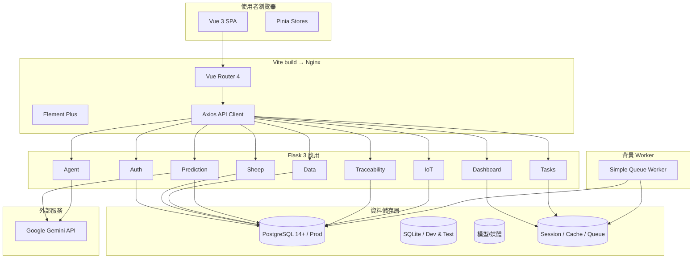
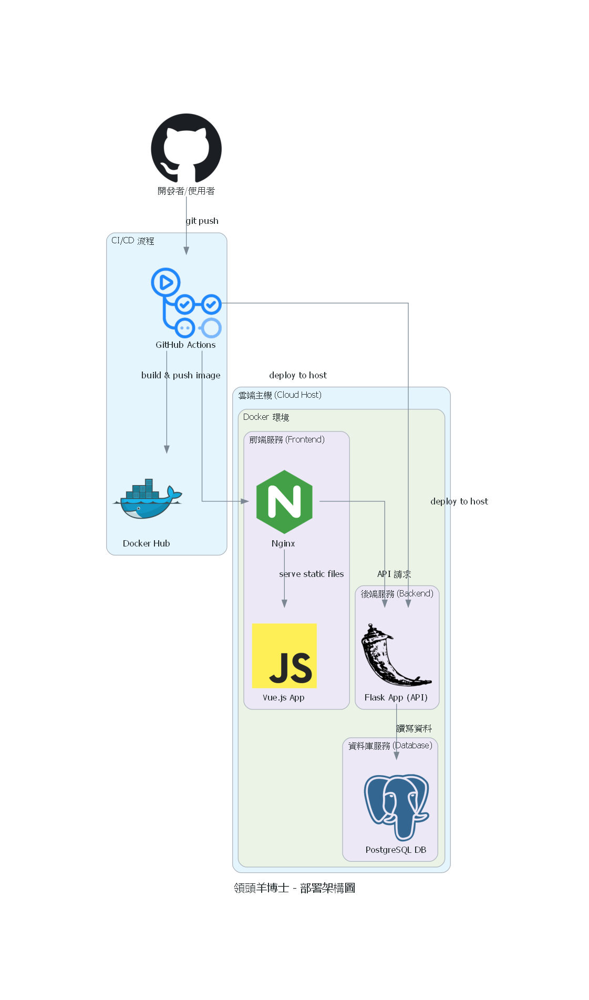

# 領頭羊博士（Goat Nutrition App）

[中文 (README)](/README.md) | [English (Docs)](/docs/README.en.md)

> 智慧化山羊營養管理平台，結合 Flask 後端、Vue 3 前端、Gemini AI 決策支援、Excel 自動化與 IoT 自動化，協助牧場即時掌握羊群、產銷履歷與 ESG 指標。

---

## 目錄

1. [專案價值與定位](#1-專案價值與定位)
2. [系統架構](#2-系統架構)
3. [後端服務 (Flask)](#3-後端服務-flask)
4. [前端應用 (Vue 3)](#4-前端應用-vue-3)
5. [AI 與機器學習能力](#5-ai-與機器學習能力)
6. [資料匯入匯出流程](#6-資料匯入匯出流程)
7. [IoT 自動化層](#7-iot-自動化層)
8. [快取、背景任務與 Worker](#8-快取背景任務與-worker)
9. [本機開發環境](#9-本機開發環境)
10. [環境變數與配置](#10-環境變數與配置)
11. [測試與品質保證](#11-測試與品質保證)
12. [部署與維運](#12-部署與維運)
13. [文件索引](#13-文件索引)
14. [疑難排解](#14-疑難排解)
15. [Roadmap 與版本記錄](#15-roadmap-與版本記錄)

---

## 1. 專案價值與定位

### 1.1 核心問題
- 整合牧場多來源資料：羊隻主檔、事件、歷史紀錄、產品批次與 ESG 指標。
- 透過 Gemini 模型提供營養建議、每日提示、多模態對話與永續策略。
- 使用 LightGBM/線性回歸結合 LLM，輸出帶信賴區間的生長預測與 ESG 解讀。
- 自動化 Excel 匯入匯出，包含欄位對映、預設範本與錯誤提示。
- 產出可分享的產銷履歷故事、時間軸與 QR code 友善資料。
- 提供不可竄改的可驗證賬本，串連產銷履歷與重大醫療事件，協助稽核與外部買家自主驗證。
- 結合 IoT 裝置資料、規則判斷與控制指令，閉環連結虛實場域。

### 1.2 功能地圖

| 範疇 | 代表功能 | 後端模組 | 前端頁面 / Store | 主要測試 |
|------|----------|----------|------------------|-----------|
| 認證 | 註冊、登入、健康檢查、預設事件字典 | `app/api/auth.py` | `LoginView.vue`、`stores/auth.js` | `tests/test_auth_api.py`、`tests/test_auth_agent_enhanced.py` |
| 羊群管理 | CRUD、歷史自動紀錄、提醒欄位、自訂事件詞庫 | `app/api/sheep.py`、`app/models.py` | `SheepListView.vue`、`stores/sheep.js` | `tests/test_sheep_api.py`、`tests/test_sheep_events_api.py`、`tests/test_sheep_enhanced.py` |
| 儀表板與報表 | 提醒、停藥檢查、健康警示、牧場摘要、Redis 快取 | `app/api/dashboard.py`、`app/cache.py` | `DashboardView.vue` | `tests/test_dashboard_api.py`、`tests/test_dashboard_enhanced.py` |
| 分析與財務 BI | 成本/收益帳冊、Cohort 分析、AI 報告、ECharts 儀表板 | `app/api/finance.py`、`app/api/bi.py` | `AnalyticsHubView.vue`、`stores/analytics.js` | `tests/test_finance_bi_api.py`、`frontend/src/stores/analytics.test.js` |
| 資料治理 | Excel 匯出/匯入、AI 導入建議、聊天紀錄匯出 | `app/api/data_management.py`、`app/utils.py` | `DataManagementView.vue`、`stores/data` | `tests/test_data_management_api.py`、`tests/test_data_management_enhanced.py`、`tests/test_data_management_error_handling.py` |
| AI 協作 | 每日提示、營養/ESG 建議、多模態聊天 | `app/api/agent.py`、`app/utils.py`、`app/models.ChatHistory` | `ConsultationView.vue`、`ChatView.vue`、`stores/consultation.js`、`stores/chat.js` | `tests/test_agent_api.py` |
| 生長預測 | 體重預估、信賴區間、ESG 說明 | `app/api/prediction.py`、`backend/models/*.joblib` | `PredictionView.vue`、`stores/prediction.js` | `tests/test_prediction_api.py` |
| 產銷履歷 | 批次流程、加工步驟、羊隻貢獻、公眾故事、可驗證 Hash 鏈 | `app/api/traceability.py` | `TraceabilityManagementView.vue`、`TraceabilityPublicView.vue`、`stores/traceability.js` | `tests/test_traceability_api.py`、`tests/test_verifiable_log.py` |
| IoT 自動化 | 裝置註冊、HMAC API Key、資料攝取、規則判斷、控制紀錄 | `app/api/iot.py`、`app/iot/automation.py` | `IotManagementView.vue`、`stores/iot.js` | `tests/test_iot_api.py`、`tests/test_iot_worker.py` |
| 背景任務 | 輕量佇列與示範任務端點 | `app/tasks.py`、`app/simple_queue.py`、`app/api/tasks.py` | 設定/維運頁面觸發 | `tests/test_tasks_api.py` |

## 2. 系統架構





## 3. 後端服務 (Flask)

- **基礎**：Python 3.11、Flask 3、SQLAlchemy 2、Pydantic 2、Redis Session、`SimpleQueue` 佇列。
- **Blueprint 重點**：
  - `auth`：註冊/登入、預設事件詞庫、健康檢查。
  - `sheep`：羊隻 CRUD、事件生命週期、關鍵欄位歷史自動紀錄、提醒欄位。
  - `data_management`：Excel 匯出/匯入、AI 映射建議、匯出聊天紀錄。
  - `dashboard`：提醒、停藥期、體重/奶量趨勢分析、事件選項管理、Redis 快取。
  - `finance`：使用者專屬的成本/收益帳冊，支援 CRUD、複合篩選與批次匯入。
  - `bi`：SQLAlchemy Core 聚合查詢、成本收益趨勢、查詢速率限制、Redis 快取與 Gemini 報告提示語。
  - `agent`：Gemini 每日提示、營養+ESG 建議、多模態聊天紀錄。
  - `prediction`：LightGBM+線性回歸、數據品質檢查、ESG LLM 解讀、圖表資料。
  - `traceability`：批次/加工步驟/羊隻關聯、公眾故事 payload、可驗證賬本寫入。
  - `iot`：裝置註冊與 HMAC API key、感測資料攝取、規則判斷、控制指令紀錄。
  - `tasks`：透過 `SimpleQueue` 排程示範任務。
  - `verify`：提供 Hash 鏈完整性檢查、串流查詢與稽核用 API。
- **資料模型**：`app/models.py` 涵蓋羊隻、事件、歷史、聊天、IoT 裝置、規則、可驗證賬本與控制紀錄，並以 Unique Constraint 確保用戶隔離。
- **工具**：`app/utils.py` 統一 Gemini 呼叫、羊隻上下文、圖片編碼；`app/cache.py` 封裝 Redis 快取與鎖。

## 4. 前端應用 (Vue 3)

- **技術**：Vue 3 `<script setup>`、Vite、Pinia、Element Plus、Axios、Chart.js、ECharts。
- **路由**：`src/router/index.js` 包含 Dashboard、Analytics Hub、Consultation、Chat、Flock、Data Management、Prediction、IoT、Traceability、Settings 等需登入路由，以及 `/login`、`/trace/:batchNumber` 公開頁面。
- **狀態管理**：`src/stores/` 依功能拆分（auth、sheep、consultation、chat、prediction、iot、traceability、analytics、settings），皆附 Vitest 覆蓋。
- **API 層**：`src/api/index.js` 統一錯誤處理、Gemini Header 注入、Multipart 上傳。
- **視圖與測試**：每個頁面皆有對應測試 (`*.test.js` / `*.behavior.test.js`) 驗證路由守衛、表單驗證、Store 行為與 UI 呈現。
- **UX**：
  - Element Plus 排版、統一 loading/toast、AI Markdown 呈現、API Key 彈窗一次顯示。
  - 公開產銷履歷每個加工步驟提供「數據指紋」彈窗，可檢視 Hash 鏈資訊並支援複製/下載，方便稽核。
  - 系統設定新增「字體大小」切換（預設／大字），同步調整 Element Plus 基準字級與全域 CSS 變數，方便熟齡牧場管理者以較大的字體操作系統。

## 5. AI 與機器學習能力

- **Gemini 整合**（`app/utils.call_gemini_api`）：
  - `/api/agent/tip`：依季節產出每日提示。
  - `/api/agent/recommendation`：融合羊隻資料與歷史事件，提供營養與 ESG 建議。
  - `/api/agent/chat`：支援圖片 (JPEG/PNG/GIF/WebP，≤10 MB) 與對話歷史。
  - `/api/bi/ai-report`：整合 Cohort 篩選與 KPI 摘要，產出可直接複製/下載的營運洞察報告。
  - `/api/prediction/*`：使用相同 helper 產出預測解說與 ESG 建議。
- **檢索增強生成（RAG）**：
  - 知識來源位於 `docs/rag_sources/`（Markdown / 純文字）。執行 `make rag-update` 可完成切塊、嵌入（Gemini `gemini-embedding-001`、768 維 L2 正規化）並輸出 `docs/rag_vectors/corpus.parquet` 至 Git LFS。
- `scripts/ingest_docs.py` 採 800 字、重疊 100 的固定切塊策略，並透過 `app/ai/embedding.py`（內建 `requests.Session` 連線池）批次呼叫嵌入 API。
- 向量快照依賴 `pyarrow` 讀寫 Parquet、`faiss-cpu` 提供高效近似最近鄰檢索，兩者皆已寫入 `backend/requirements.txt`。
- `make rag-update` 會自動產生向量並建立本地 commit，但保留 `git push` 由開發者手動確認。
- `app/rag_loader.ensure_vectors()` 啟動時載入 Parquet 向量、序列化快照至 Redis 供多個 Worker 共用，並建構 FAISS Index；若檔案缺失會自動嘗試 `git lfs pull`，仍失敗則僅記錄警告並降級為無 context 模式。
  - `/api/agent/recommendation` 與 `/api/agent/chat` 在原有 Prompt 前加入 Top-k 參考片段（餘弦相似度 ≥0.75），維持既有前端與 API 契約。
- **生長預測**（`app/api/prediction.py`）：
  - LightGBM 分位數模型搭配線性迴歸備援，僅支援 60–365 天幼羊。
  - 進行資料品質檢查（筆數、時間跨度、異常值）。
  - 回傳 q10/q90 區間、每日預測序列、品種參考對照。
  - 若 Gemini 失敗則提供備援說明文字。
- **模型資產**：位於 `backend/models/`，包含特徵順序與類別編碼 metadata，重新訓練時請同步更新。

## 6. 資料匯入匯出流程

- **匯出** `GET /api/data/export_excel`：輸出羊隻、事件、歷史、聊天紀錄，多工作表；無資料時提供提示頁。
- **結構分析** `POST /api/data/analyze_excel`：回傳每張工作表欄位與預覽，供手動映射。
- **AI 映射** `POST /api/data/ai_import_mapping`：上傳 Excel + Gemini API Key，取得建議用途、欄位映射、信心值與警示。
- **匯入** `POST /api/data/process_import`：支援預設範本或自訂配置，包含品種/性別代碼轉換、日期清洗、事件/歷史自動建立。
- **驗證**：依用途檢查必要欄位，Pydantic 回傳友善錯誤訊息與 `details` 說明。

## 7. IoT 自動化層

- **裝置註冊**：`IotDevice` 儲存類型、分類（sensor/actuator）、HMAC API Key digest、最後連線時間。
- **資料攝取** `POST /api/iot/ingest`：驗證 API Key、儲存讀值、更新狀態並推送佇列。
- **自動化規則**：定義觸發裝置/條件與致動裝置/指令；驗證只能由感測器觸發致動器。
- **佇列與 Worker**：`app/iot/automation.py` 以 Redis list 實作感測/控制佇列，Worker 評估條件、發送 HTTP 指令並寫入控制紀錄。
- **模擬器**：`iot_simulator/` 提供 Docker 化感測器，詳細流程請參閱 `docs/iot.md`。

## 8. 快取、背景任務與 Worker

- **Session 與快取**：Redis 作為 Flask Session；`app/cache.py` 針對 Dashboard 以 TTL + 鎖避免併發重算。
- **SimpleQueue**：使用 Redis list，提供 `enqueue_example_task` 示範，並由 `app/tasks.py` 暴露 API。
- **Worker**：`backend/run_worker.py`、`start_*` 腳本負責啟動背景任務與 IoT 控制流程。
- **可驗證賬本檢查**：`app/tasks.verify_verifiable_log_chain` 會記錄 Hash 鏈完整性並在異常時寫入錯誤 log；`enqueue_verifiable_log_verification` 可做排程或手動觸發。

## 9. 本機開發環境

> 以下以 macOS/Linux shell 為例，Windows PowerShell 請調整路徑與環境變數語法。

### 9.1 建置依賴

```bash
cp .env.example .env  # 依下節說明填入密鑰

cd backend
python3 -m venv .venv
source .venv/bin/activate
pip install -r requirements.txt

cd ../frontend
npm install
```

### 9.2 啟動服務

```bash
# Redis（可改用 Docker）
docker run --rm -p 6379:6379 redis:7.2-alpine redis-server --requirepass "$REDIS_PASSWORD"

# 後端（預設 SQLite）
cd backend
export FLASK_ENV=development
export CORS_ORIGINS="http://localhost:5173"
python run.py

# 前端（Vite）
cd ../frontend
npm run dev
```

後端預設 `http://127.0.0.1:5001`，前端開發伺服器 `http://127.0.0.1:5173`，並透過 proxy 轉發 `/api`。

### 9.3 常用指令

- 建立範例資料：`python backend/create_test_data.py`
- 啟動背景 Worker：`python backend/run_worker.py`
- 模擬 IoT 裝置：`python iot_simulator/simulator.py --api-key <KEY> --device-type barn_environment`

## 10. 環境變數與配置

- `SECRET_KEY`：Flask Session 密鑰（必填）。
- `API_HMAC_SECRET`：IoT API Key HMAC 密鑰（≥32 bytes，必填）。
- `GOOGLE_API_KEY`：Gemini API Key（用戶未帶 `X-Api-Key` 時使用）。
- `POSTGRES_*`：生產環境資料庫設定，未設置則使用 SQLite。
- `REDIS_URL` 或 `REDIS_HOST/PORT/PASSWORD`：Redis 連線設定；測試可設 `USE_FAKE_REDIS_FOR_TESTS=1`。
- `CORS_ORIGINS`：生產環境允許的前端來源（逗號分隔）。
- `RQ_QUEUE_NAME`：背景任務佇列名稱。

完整清單請參考 `.env.example` 與部署腳本。

## 11. 測試與品質保證

### 11.1 後端（Pytest）

```bash
cd backend
pytest
pytest --cov=app --cov-report=term-missing
```

涵蓋認證、羊隻 CRUD/事件/歷史、匯入錯誤處理、儀表板快取、AI 端點（Gemini 模擬）、預測輸出、產銷履歷流程、IoT 攝取與自動化、背景任務排程。

### 11.2 前端（Vitest + ESLint）

```bash
cd frontend
npm run test -- --run
npm run lint
```

測試位於 `src/views/`、`src/stores/`，驗證路由守衛、表單驗證、Store 行為與元件渲染。

### 11.3 整合測試

- `docker compose up` 檢查端對端。
- `test_image_upload.py` 驗證 `/api/agent/chat` 圖片流程。
- `manual_test.py`、`manual_functional_test.py` 提供手動腳本。

## 12. 部署與維運

- **Docker Compose**：`docker-compose.yml` 啟動 backend、frontend(Nginx)、PostgreSQL、Redis、IoT 模擬器。請確保 `.env` 與生產一致。
- **啟動流程**：`backend/docker-entrypoint.sh` 執行 `flask db upgrade`；`frontend/nginx.conf` 服務打包後 SPA。
- **健康檢查**：`/api/auth/health`（後端）、`/api/auth/status`（Session）、`/docs`（Swagger UI）。
- **觀測性**：生產建議設 `FLASK_ENV=production` 並監看 worker log 以掌握佇列狀態。
- **備份**：定期備份 PostgreSQL volume 與 `backend/models/` 模型資產。

## 13. 文件索引

| 範疇 | 文件 | 說明 |
|------|------|------|
| 快速啟動 | [`docs/QuickStart.md`](docs/QuickStart.md) | 本機建置、常用流程、API 驗證 |
| 開發指南 | [`docs/Development.md`](docs/Development.md) | 程式架構、命名慣例、測試策略 |
| 部署指南 | [`docs/Deployment.md`](docs/Deployment.md) | Docker Compose、環境準備、維運指引 |
| API 參考 | [`docs/API.md`](docs/API.md) | 端點清單、授權規則、欄位說明 |
| FAQ | [`docs/FAQ.md`](docs/FAQ.md) | 常見問題與除錯建議 |
| IoT 指南 | [`docs/iot.md`](docs/iot.md) | 模擬器與多裝置場景操作 |
| 術語表 | [`docs/glossary.md`](docs/glossary.md) | 中英對照術語維護一致性 |
| Roadmap | [`docs/project_roadmap.md`](docs/project_roadmap.md) | 里程碑與 ADR 參考 |

## 14. 疑難排解

- **登入後仍 401**：確認瀏覽器允許 Cookie，或檢查 Redis Session 是否正常連線。
- **預測被拒**：需至少 3 筆體重紀錄且羊齡介於 60–365 天。
- **AI 失敗**：補上 `X-Api-Key` 或設定 `GOOGLE_API_KEY`，檢查後端 log 是否出現配額錯誤。
- **Excel 匯入警示**：檢視回傳的 `details` 陣列調整映射設定。
- **IoT 裝置離線**：重新建立裝置取得新 API Key，確認模擬器或裝置使用最新密鑰。
- **儀表板資料未更新**：羊隻/事件/歷史更新會觸發快取失效，如需強制更新可再次呼叫 `/api/dashboard/data`。

## 15. Roadmap 與版本記錄

請參閱 [`docs/project_roadmap.md`](docs/project_roadmap.md) 與 `docs/adr/` 以了解架構決策、未來規劃與升級歷程。提交 PR 時請盡量引用相關 ADR 以維持可追蹤性。

---

本文件為對外導覽；最新且唯一事實來源為 `/docs/README.en.md`，請優先更新英文版後再同步此處內容。
