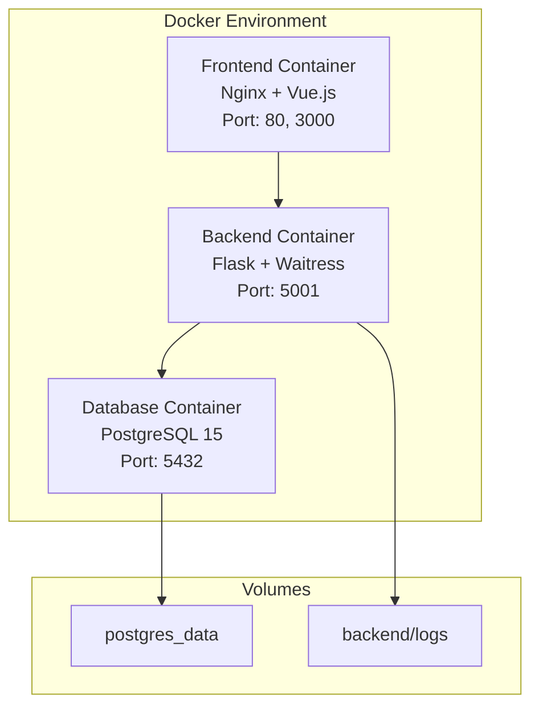

# 領頭羊博士 - 後端系統說明文件

## 1. 專案概述

本文件旨在詳細說明「領頭羊博士」應用程式的後端系統。此後端基於 **Python Flask** 框架，採用應用程式工廠 (`create_app`) 模式建構，具備高度模組化與擴展性的架構設計。

### 系統核心特性

- **羊隻營養管理系統**：專為羊隻飼養管理設計的綜合性平台
- **AI 智慧代理**：整合 Google Generative AI 提供智慧化問答與建議
- **完整數據管理**：支援 Excel 匯入/匯出、歷史數據追蹤
- **生長預測模型**：基於機器學習的羊隻生長預測功能
- **ESG 永續管理**：包含動物福利評分、糞肥管理等永續性指標

### 系統核心職責

- 提供 RESTful API 與前端應用程式進行數據交換
- 處理使用者身份驗證與權限管理
- 進行羊隻數據的 CRUD (建立、讀取、更新、刪除) 操作
- 執行基於歷史數據的生長預測模型
- 管理羊隻事件記錄與歷史數據追蹤
- 提供智慧代理服務與對話功能
- 支援數據匯入匯出與範本管理
- 透過 Docker 容器化，實現快速部署與環境一致性

## 2. 技術棧

### 核心框架與函式庫
- **後端框架**: Flask 3.0.3
- **資料庫 ORM**: Flask-SQLAlchemy 3.1.1  
- **資料庫遷移**: Flask-Migrate 4.0.7 (使用 Alembic 1.13.1)
- **使用者會話管理**: Flask-Login 0.6.3
- **跨域請求處理**: Flask-Cors 4.0.1

### 資料庫系統
- **主要資料庫**: PostgreSQL (生產環境)
- **開發資料庫**: SQLite (開發備用)
- **資料庫驅動**: psycopg2-binary 2.9.9

### Web 伺服器與部署
- **WSGI 伺服器**: Waitress 3.0.0 (開發環境), Gunicorn 22.0.0 (生產環境)
- **容器化**: Docker & Docker Compose
- **反向代理**: Nginx (前端容器內)

### 數據處理與分析
- **數據驗證**: Pydantic 2.7.1
- **數據處理**: Pandas 2.2.2, NumPy 1.26.4
- **Excel 處理**: OpenPyXL 3.1.4
- **機器學習**: scikit-learn 1.5.1

### AI 與智慧服務
- **AI 整合**: Google Generative AI 0.8.5
- **對話處理**: Markdown 3.6

### 測試與品質保證
- **測試框架**: Pytest 8.2.0
- **覆蓋率測試**: pytest-cov 5.0.0
- **模擬測試**: pytest-mock 3.11.1

### 工具與配置
- **環境變數管理**: python-dotenv 1.0.1
- **HTTP 請求**: requests 2.32.3
- **時間處理**: python-dateutil 2.9.0.post0, pytz 2024.1

## 3. 架構設計

### 應用程式結構

```
backend/
├── app/                        # Flask 應用程式核心
│   ├── __init__.py             # Flask 應用程式工廠 (create_app)
│   ├── error_handlers.py       # 統一錯誤處理器
│   ├── models.py               # SQLAlchemy 資料模型
│   ├── schemas.py              # Pydantic 資料驗證模型
│   ├── utils.py                # 工具函數與 AI 整合
│   └── api/                    # RESTful API 藍圖
│       ├── __init__.py         # API 藍圖註冊
│       ├── agent.py            # AI 代理人 API
│       ├── auth.py             # 身份驗證 API
│       ├── dashboard.py        # 儀表板數據 API
│       ├── data_management.py  # 數據管理 API
│       ├── prediction.py       # 生長預測 API
│       └── sheep.py            # 羊隻管理 API
├── docs/                       # 說明文件
├── instance/                   # Flask 實例特定檔案
│   └── app.db                  # SQLite 開發資料庫
├── logs/                       # 應用程式日誌
├── migrations/                 # Alembic 資料庫遷移檔案
├── tests/                      # 測試套件
├── alembic.ini                 # Alembic 設定檔
├── Dockerfile                  # Docker 容器配置
├── docker-entrypoint.sh        # Docker 啟動腳本
├── pytest.ini                 # 測試設定檔
├── requirements.txt            # Python 依賴套件
└── run.py                      # 應用程式啟動檔
```

### 資料模型架構

系統包含以下主要資料模型：

#### 核心模型
- **User**: 使用者帳戶管理
- **Sheep**: 羊隻基本資料與生產資訊
- **SheepEvent**: 羊隻事件記錄 (疫苗、治療、配種等)
- **SheepHistoricalData**: 羊隻歷史數據追蹤

#### 配置模型
- **EventTypeOption**: 事件類型選項
- **EventDescriptionOption**: 事件描述選項
- **ChatHistory**: AI 對話歷史記錄

## 4. API 模組與路由

系統透過 Flask Blueprints 將 API 模組化，主要端點註冊在 `app/__init__.py` 中，完整路由結構如下：

### 使用者認證模組 (/api/auth)
| HTTP 方法 | 路徑 | 功能描述 |
|-----------|------|----------|
| POST | `/register` | 使用者註冊 |
| POST | `/login` | 使用者登入 |
| POST | `/logout` | 使用者登出 |
| GET | `/status` | 檢查登入狀態 |
| GET | `/health` | 健康檢查端點 |

### 羊隻管理模組 (/api/sheep)
| HTTP 方法 | 路徑 | 功能描述 |
|-----------|------|----------|
| GET | `/` | 取得羊隻列表 |
| POST | `/` | 新增羊隻記錄 |
| GET | `/<string:ear_num>` | 取得特定羊隻資料 |
| PUT | `/<string:ear_num>` | 更新羊隻資料 |
| DELETE | `/<string:ear_num>` | 刪除羊隻記錄 |
| GET | `/<string:ear_num>/events` | 取得羊隻事件記錄 |
| POST | `/<string:ear_num>/events` | 新增羊隻事件 |
| PUT | `/events/<int:event_id>` | 更新事件記錄 |
| DELETE | `/events/<int:event_id>` | 刪除事件記錄 |
| GET | `/<string:ear_num>/history` | 取得歷史數據 |
| DELETE | `/history/<int:record_id>` | 刪除歷史記錄 |

### 數據管理模組 (/api/data)
| HTTP 方法 | 路徑 | 功能描述 |
|-----------|------|----------|
| GET | `/export_excel` | 匯出 Excel 檔案 |
| POST | `/analyze_excel` | 分析 Excel 檔案格式 |
| POST | `/process_import` | 處理檔案匯入 |

### 智慧代理模組 (/api/agent)
| HTTP 方法 | 路徑 | 功能描述 |
|-----------|------|----------|
| POST | `/chat` | AI 對話諮詢 |
| GET | `/history` | 取得對話歷史 |
| DELETE | `/history` | 清除對話歷史 |

### 儀表板模組 (/api/dashboard)
| HTTP 方法 | 路徑 | 功能描述 |
|-----------|------|----------|
| GET | `/data` | 取得儀表板統計數據 |
| GET | `/farm_report` | 生成牧場報告 |
| GET | `/event_options` | 取得事件選項 |
| POST | `/event_types` | 新增事件類型 |
| DELETE | `/event_types/<int:type_id>` | 刪除事件類型 |

### 生長預測模組 (/api/prediction)
| HTTP 方法 | 路徑 | 功能描述 |
|-----------|------|----------|
| GET | `/goats/<string:ear_tag>/prediction` | 取得生長預測數據 |
| GET | `/goats/<string:ear_tag>/prediction/chart-data` | 取得預測圖表數據 |

## 5. 環境變數與組態

系統的組態高度依賴環境變數，透過 `.env` 檔案進行管理。請將 `backend` 目錄下的 `.env.example` 複製為 `.env` 並填寫以下變數：

### 資料庫配置
| 變數名稱 | 說明 | 範例值 |
|----------|------|--------|
| `POSTGRES_USER` | PostgreSQL 資料庫使用者名稱 | `goat_user` |
| `POSTGRES_PASSWORD` | PostgreSQL 資料庫密碼 | `goat_password` |
| `POSTGRES_HOST` | 資料庫主機位址 | `db` 或 `localhost` |
| `POSTGRES_PORT` | 資料庫埠口 | `5432` |
| `POSTGRES_DB` | 資料庫名稱 | `goat_nutrition_db` |

### Flask 應用程式配置
| 變數名稱 | 說明 | 範例值 |
|----------|------|--------|
| `FLASK_APP` | Flask 應用程式的啟動檔案 | `run.py` |
| `FLASK_ENV` | 運行環境 | `development` 或 `production` |
| `FLASK_DEBUG` | 除錯模式 | `True` 或 `False` |
| `SECRET_KEY` | 加密密鑰 | `a-very-strong-and-random-secret-key` |

### 跨域與安全配置
| 變數名稱 | 說明 | 範例值 |
|----------|------|--------|
| `CORS_ORIGINS` | 允許跨域請求的來源 | `http://localhost:3000,https://*.githubpreview.dev` |

### AI 服務配置
| 變數名稱 | 說明 | 範例值 |
|----------|------|--------|
| `GOOGLE_API_KEY` | Google Generative AI API 金鑰 | `your-google-api-key` |

**注意**: 如果未提供 PostgreSQL 相關的環境變數，系統將會自動降級使用 `instance/app.db` 這個 SQLite 資料庫檔案，方便開發測試。

## 6. 本地開發環境設定

### 前置需求
- Python 3.9+
- PostgreSQL Server (可選，若無則使用 SQLite)
- Git

### 安裝與啟動步驟

1.  **克隆儲存庫**
    ```bash
    git clone <repository-url>
    cd Goat_Nutrition_App_Optimization_Test-0801test1/backend
    ```

2.  **建立並啟用 Python 虛擬環境**
    ```bash
    # Windows
    python -m venv venv
    .\venv\Scripts\activate

    # macOS/Linux
    python3 -m venv venv
    source venv/bin/activate
    ```

3.  **安裝依賴套件**
    ```bash
    pip install -r requirements.txt
    ```

4.  **設定 `.env` 檔案**
    複製 `.env.example` 為 `.env`，並根據您的本地開發環境填寫上述環境變數。

5.  **初始化資料庫**
    ```bash
    # 僅在第一次設定時執行
    flask db init

    # 產生遷移腳本並應用到資料庫
    flask db migrate -m "Initial database setup"
    flask db upgrade
    ```

6.  **啟動開發伺服器**
    ```bash
    # 方式一：使用 Flask 開發伺服器
    flask run --port 5001

    # 方式二：使用 run.py 腳本
    python run.py
    ```
    應用程式將在 `http://127.0.0.1:5001` 上運行。

## 7. 使用 Docker 部署

本專案已完全容器化，推薦使用 Docker Compose 進行部署，以確保環境一致性。

### 部署架構



### 部署步驟

1.  **前置需求**:
    - Docker
    - Docker Compose

2.  **設定環境變數**:
    - 在專案根目錄下，確保 `docker-compose.yml` 所需的環境變數已設定。特別是 `GOOGLE_API_KEY`。您可以建立一個 `.env` 檔案放在根目錄，Docker Compose 會自動讀取。

3.  **建置並啟動服務**:
    在專案根目錄執行：
    ```bash
    docker-compose up --build
    ```
    此命令將會：
    - 建立 `goat-network` 虛擬網路
    - 啟動名為 `db` 的 PostgreSQL 服務
    - 建置後端 Docker 映像並啟動 `backend` 服務
    - 建置前端 Docker 映像並啟動 `frontend` 服務 (Nginx)

4.  **服務存取**:
    - **後端 API**: `http://localhost:5001`
    - **前端應用**: `http://localhost:80` 或 `http://localhost:3000`

5.  **停止服務**:
    ```bash
    docker-compose down
    ```

6.  **查看服務狀態**:
    ```bash
    # 查看容器狀態
    docker-compose ps
    
    # 查看後端日誌
    docker-compose logs backend
    
    # 查看資料庫日誌
    docker-compose logs db
    ```

### 健康檢查

所有服務都配置了健康檢查機制：

- **資料庫**: 每 10 秒檢查一次 PostgreSQL 連線
- **後端**: 每 30 秒檢查 `/api/auth/status` 端點
- **前端**: 每 30 秒檢查主頁面回應

## 8. 資料庫管理

### 資料庫遷移

使用 Flask-Migrate (Alembic) 進行資料庫版本控制：

```bash
# 建立新的遷移腳本
flask db migrate -m "遷移描述"

# 套用遷移到資料庫
flask db upgrade

# 查看遷移歷史
flask db history

# 回退到特定版本
flask db downgrade <revision_id>

# 查看目前版本
flask db current
```

### 資料庫備份與恢復

```bash
# PostgreSQL 備份
docker-compose exec db pg_dump -U goat_user goat_nutrition_db > backup.sql

# PostgreSQL 恢復
docker-compose exec -T db psql -U goat_user goat_nutrition_db < backup.sql

# SQLite 備份 (開發環境)
cp instance/app.db backup_app.db
```

## 9. 執行測試

### 測試架構概述

系統採用 Pytest 測試框架，具備完整的測試覆蓋率：

- **總測試數量**: 198+ 項測試
- **測試覆蓋率**: 94%+
- **測試類型**: 單元測試、整合測試、API 測試

### 測試執行指令

```bash
# 執行所有測試
pytest

# 執行特定測試檔案
pytest tests/test_sheep_api.py -v

# 執行測試並產生覆蓋率報告
pytest --cov=app --cov-report=html --cov-report=term-missing

# 執行測試並產生 XML 報告
pytest --junitxml=test-results.xml

# 執行特定標記的測試
pytest -m "unit"  # 單元測試
pytest -m "integration"  # 整合測試
```

### 測試組織結構

```
tests/
├── conftest.py                 # 測試配置與夾具
├── test_auth_api.py           # 身份驗證 API 測試
├── test_sheep_api.py          # 羊隻管理 API 測試
├── test_agent_api.py          # AI 代理人 API 測試
├── test_dashboard_api.py      # 儀表板 API 測試
├── test_data_management_api.py # 數據管理 API 測試
├── test_prediction_api.py     # 預測 API 測試
└── test_*_enhanced.py         # 增強功能測試
```

### 測試覆蓋率報告

| 模組 | 覆蓋率 | 狀態 |
|------|--------|------|
| app/models.py | 96% | ✅ 優秀 |
| app/api/data_management.py | 98% | ✅ 優秀 |
| app/api/sheep.py | 98% | ✅ 優秀 |
| app/api/auth.py | 94% | ✅ 良好 |
| app/api/dashboard.py | 88% | ✅ 良好 |
| app/api/agent.py | 90% | ✅ 良好 |

## 10. 開發工具與除錯

### 除錯工具

系統提供多個除錯工具協助開發：

```bash
# 身份驗證除錯
python auth_debug.py

# 系統功能除錯
python debug_test.py

# 手動功能測試
python manual_functional_test.py

# 完整 API 測試
python test_full_api.py

# PostgreSQL 連線測試
python test_postgresql.py

# 預測模型測試
python test_prediction_manual.py
```

### 日誌管理

應用程式日誌儲存在 `logs/` 目錄：

```bash
# 查看即時日誌
tail -f logs/app.log

# 查看錯誤日誌
grep "ERROR" logs/app.log

# 查看特定時間的日誌
grep "2025-08-07" logs/app.log
```

### 開發環境配置

#### VS Code 配置

建議的 VS Code 擴展：
- Python
- Pylance
- Python Docstring Generator
- GitLens
- Docker

#### 程式碼品質工具

```bash
# 安裝開發依賴
pip install flake8 black isort

# 程式碼格式化
black app/ tests/

# 匯入排序
isort app/ tests/

# 程式碼檢查
flake8 app/ tests/
```

## 11. 安全性考量

### 身份驗證與授權

- **會話管理**: 使用 Flask-Login 管理使用者會話
- **密碼安全**: Werkzeug 密碼雜湊，採用 PBKDF2 算法
- **CSRF 保護**: 跨站請求偽造保護機制

### 資料驗證與清理

- **輸入驗證**: Pydantic 模型進行嚴格的資料驗證
- **SQL 注入防護**: SQLAlchemy ORM 自動參數化查詢
- **XSS 防護**: 前端數據清理與轉義

### API 安全

- **認證中介軟體**: `@login_required` 裝飾器保護敏感端點
- **CORS 配置**: 限制跨域請求來源
- **錯誤處理**: 統一錯誤處理，避免敏感資訊洩露

### 建議的額外安全措施

```python
# 速率限制 (建議實施)
from flask_limiter import Limiter

# API 金鑰驗證
# JWT Token 認證
# HTTPS 強制重定向
```

## 12. 效能優化

### 資料庫優化

```python
# 索引建立
db.Index('idx_sheep_user_ear', Sheep.user_id, Sheep.EarNum)
db.Index('idx_events_date', SheepEvent.event_date)

# 查詢優化
query = Sheep.query.options(
    joinedload(Sheep.events),
    joinedload(Sheep.historical_data)
).filter_by(user_id=current_user.id)
```

### 快取策略

```python
# Redis 快取 (建議實施)
from flask_caching import Cache

cache = Cache()
cache.init_app(app)

@cache.cached(timeout=300)
def get_dashboard_stats():
    # 儀表板統計快取 5 分鐘
    pass
```

### 背景任務處理

```python
# Celery 背景任務 (建議實施)
from celery import Celery

# 大量數據匯入處理
# 預測模型計算
# 定期報告生成
```

## 13. 監控與觀測

### 健康檢查端點

```python
@bp.route('/health', methods=['GET'])
def health_check():
    """系統健康檢查"""
    return jsonify({
        'status': 'healthy',
        'timestamp': datetime.utcnow().isoformat(),
        'version': '2.0.0'
    })
```

### 應用程式指標

建議實施的監控指標：

- **回應時間**: API 端點回應時間
- **錯誤率**: HTTP 4xx/5xx 錯誤比例
- **資料庫連線**: 連線池使用情況
- **記憶體使用**: 容器記憶體使用量
- **CPU 使用**: 容器 CPU 使用率

### 日誌聚合

```python
import logging
from logging.handlers import RotatingFileHandler

# 配置輪轉日誌
if not app.debug:
    file_handler = RotatingFileHandler(
        'logs/app.log', maxBytes=10240, backupCount=10
    )
    file_handler.setFormatter(logging.Formatter(
        '%(asctime)s %(levelname)s: %(message)s [in %(pathname)s:%(lineno)d]'
    ))
    file_handler.setLevel(logging.INFO)
    app.logger.addHandler(file_handler)
```

## 14. 部署與維護

### 生產環境檢查清單

- [ ] 環境變數設定完成
- [ ] 資料庫備份機制建立
- [ ] SSL 憑證配置
- [ ] 防火牆規則設定
- [ ] 監控系統部署
- [ ] 日誌輪轉配置
- [ ] 定期備份腳本

### 更新部署流程

```bash
# 1. 備份資料庫
docker-compose exec db pg_dump -U goat_user goat_nutrition_db > backup.sql

# 2. 拉取最新代碼
git pull origin main

# 3. 停止服務
docker-compose down

# 4. 重新建置並啟動
docker-compose up --build -d

# 5. 檢查服務狀態
docker-compose ps
docker-compose logs backend
```

### 故障排除

常見問題與解決方案：

1. **資料庫連線失敗**
   ```bash
   # 檢查 PostgreSQL 服務
   docker-compose logs db
   
   # 檢查網路連接
   docker network ls
   ```

2. **API 回應緩慢**
   ```bash
   # 檢查資料庫查詢效能
   # 檢查記憶體使用情況
   # 分析日誌找出瓶頸
   ```

3. **容器啟動失敗**
   ```bash
   # 檢查 Docker 日誌
   docker-compose logs
   
   # 檢查資源使用情況
   docker system df
   ```

## 15. 開發最佳實踐

### 程式碼結構

```python
# API 端點結構
@bp.route('/endpoint', methods=['POST'])
@login_required
def endpoint_function():
    """
    端點功能描述
    
    Returns:
        JSON: 回應格式描述
    """
    try:
        # 1. 資料驗證
        # 2. 業務邏輯處理
        # 3. 資料庫操作
        # 4. 回應格式化
        pass
    except Exception as e:
        return jsonify({'error': str(e)}), 500
```

### 錯誤處理

```python
# 統一錯誤處理
@app.errorhandler(404)
def not_found(error):
    return jsonify({'error': 'Resource not found'}), 404

@app.errorhandler(500)
def internal_error(error):
    db.session.rollback()
    return jsonify({'error': 'Internal server error'}), 500
```

### 資料驗證

```python
from pydantic import BaseModel, validator

class SheepCreateModel(BaseModel):
    ear_num: str
    birth_date: Optional[str] = None
    
    @validator('ear_num')
    def ear_num_must_not_be_empty(cls, v):
        if not v.strip():
            raise ValueError('耳號不能為空')
        return v.strip()
```

## 16. 更新日誌

### v2.0.0 (2025-08-07) - 最新版本
- ✅ 完成專案架構全面檢視與文檔更新
- ✅ 確認所有 API 端點功能完整性
- ✅ 驗證 Docker 部署配置正確性
- ✅ 更新技術棧版本資訊
- ✅ 補充安全性與效能最佳實踐

### v1.9.0 (2025-07-30)
- ✅ 完成 Pydantic V1→V2 遷移
- ✅ 提升測試覆蓋率至 94%
- ✅ 新增 ESG 永續指標支援
- ✅ 優化 AI 代理人回應速度
- ✅ 增強錯誤處理機制

### v1.8.0
- ✅ 新增生長預測 API 模組
- ✅ 整合機器學習模型
- ✅ 支援圖表數據生成
- ✅ 優化數據處理效能

### v1.7.0
- ✅ 實施 ESG 相關欄位
- ✅ 新增動物福利評分
- ✅ 支援糞肥管理記錄
- ✅ 增強數據匯出功能

### v1.6.0
- ✅ 整合 Google Gemini AI
- ✅ 實施完整測試套件
- ✅ 新增 Excel 匯入匯出功能
- ✅ 支援 Docker 容器化部署

## 17. 授權

### 授權條款
本專案採用 MIT 授權條款 - 詳見專案根目錄 LICENSE 檔案

---

*本文件最後更新於 2025-08-07*
*文件版本：v2.0.0*
*維護者：領頭羊博士開發團隊*
