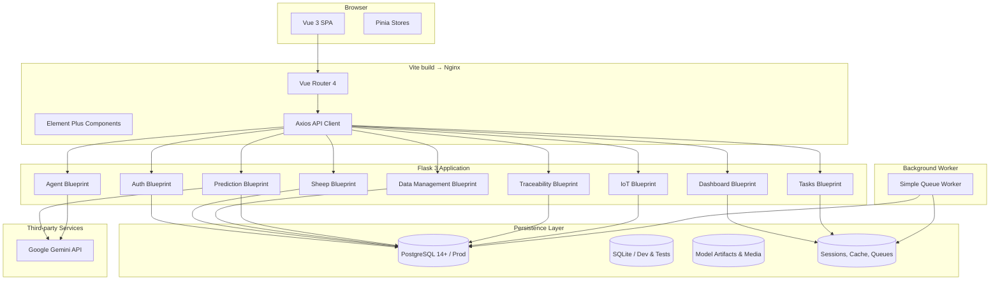

# Goat Nutrition App – Comprehensive Guide

[中文 (README)](/README.md) | [English (Docs)](/docs/README.en.md)

> An intelligent goat nutrition management platform that blends a Flask backend, Vue 3 SPA, Gemini-powered decision support, Excel automation, and IoT automation so that farms can monitor herds, trace products, and report ESG metrics in real time.

---

## Table of Contents

1. [Mission & Product Value](#1-mission--product-value)
2. [System Architecture & Data Flow](#2-system-architecture--data-flow)
3. [Backend Services (Flask)](#3-backend-services-flask)
4. [Frontend Application (Vue 3)](#4-frontend-application-vue-3)
5. [AI & Machine Learning Capabilities](#5-ai--machine-learning-capabilities)
6. [Data Import & Export Pipelines](#6-data-import--export-pipelines)
7. [IoT Automation Layer](#7-iot-automation-layer)
8. [Caching, Background Tasks & Workers](#8-caching-background-tasks--workers)
9. [Local Development Environment](#9-local-development-environment)
10. [Environment Variables & Configuration](#10-environment-variables--configuration)
11. [Testing & Quality Assurance](#11-testing--quality-assurance)
12. [Deployment & Operations](#12-deployment--operations)
13. [Documentation & Asset Index](#13-documentation--asset-index)
14. [Troubleshooting & Optimisation Tips](#14-troubleshooting--optimisation-tips)
15. [Release Notes & Roadmap](#15-release-notes--roadmap)

---

## 1. Mission & Product Value

### 1.1 Core Problems Addressed
- Consolidate multi-source ranch data: individual sheep profiles, events, historical readings, production batches, and ESG indicators.
- Deliver AI-assisted nutrition advice, daily operational tips, multimodal chat, and sustainability guidance via Gemini models.
- Surface growth forecasts with confidence intervals from LightGBM/linear regression plus LLM interpretation.
- Streamline Excel-based batch import/export with automatic column mapping, default templates, and validation feedback.
- Publish shareable traceability stories, timeline views, and QR-friendly endpoints for consumer transparency.
- Guarantee tamper-evident auditability with an append-only hash chain covering traceability milestones and critical health events.
- Close the loop between virtual data and barn hardware through IoT ingest, rule evaluation, and control dispatch.

### 1.2 Feature Map

| Domain | Representative Features | Backend Modules | Frontend Views / Stores | Primary Tests |
|--------|------------------------|-----------------|-------------------------|---------------|
| Authentication | Registration, login, health checks, seeded event options | `app/api/auth.py` | `LoginView.vue`, `stores/auth.js` | `tests/test_auth_api.py`, `tests/test_auth_agent_enhanced.py` |
| Sheep Management | CRUD, auto history logging, reminders, custom event vocabularies | `app/api/sheep.py`, `app/models.py` | `SheepListView.vue`, `stores/sheep.js` | `tests/test_sheep_api.py`, `tests/test_sheep_events_api.py`, `tests/test_sheep_enhanced.py` |
| Dashboard & Reports | Cached reminders, medication withdrawal checks, health alerts, farm summary | `app/api/dashboard.py`, `app/cache.py` | `DashboardView.vue`, `stores/dashboard` (computed from API) | `tests/test_dashboard_api.py`, `tests/test_dashboard_enhanced.py` |
| Data Management | Excel export/import, AI-assisted mapping, chat history export | `app/api/data_management.py`, `app/utils.py` | `DataManagementView.vue`, `stores/data` | `tests/test_data_management_api.py`, `tests/test_data_management_enhanced.py`, `tests/test_data_management_error_handling.py` |
| AI Assistant | Daily tips, nutrition/ESG recommendations, multimodal chat with history | `app/api/agent.py`, `app/utils.py`, `app/models.ChatHistory` | `ConsultationView.vue`, `ChatView.vue`, `stores/consultation.js`, `stores/chat.js` | `tests/test_agent_api.py` |
| Growth Prediction | Weight projections, confidence bands, ESG-aware guidance | `app/api/prediction.py`, `backend/models/*.joblib` | `PredictionView.vue`, `stores/prediction.js` | `tests/test_prediction_api.py` |
| Financial Intelligence | Cost & revenue CRUD, cohort analytics (DB joins), cost-benefit KPI cache, KPI strip/alert bar UI, floating action workflows, AI report generation | `app/api/finance.py`, `app/api/bi.py`, `app/cache.py`, `app/models.py` | `AnalyticsHubView.vue`, `stores/analytics.js` | `tests/test_finance_api.py`, `tests/test_bi_api.py`, `tests/test_agent_analytics_report.py`, `frontend/src/stores/analytics.test.js` |
| Traceability | Batch lifecycle, steps, sheep contributions, public storytelling, verifiable hash chain | `app/api/traceability.py` | `TraceabilityManagementView.vue`, `TraceabilityPublicView.vue`, `stores/traceability.js` | `tests/test_traceability_api.py`, `tests/test_verifiable_log.py` |
| IoT Automation | Device registry, API-key HMAC, sensor ingest, rule execution, control logs | `app/api/iot.py`, `app/iot/automation.py` | `IotManagementView.vue`, `stores/iot.js` | `tests/test_iot_api.py`, `tests/test_iot_worker.py` |
| Background Tasks | Lightweight queue wrapper and demo job endpoint | `app/tasks.py`, `app/simple_queue.py`, `app/api/tasks.py` | Triggered from settings/tasks UI | `tests/test_tasks_api.py` |

## 2. System Architecture & Data Flow




## 3. Backend Services (Flask)

- **Framework & Tooling**: Python 3.11, Flask 3, SQLAlchemy 2.0, Pydantic 2, Redis client abstraction (`InMemoryRedis` for tests), SimpleQueue wrapper for RQ-like semantics.
- **Blueprint overview**:
  - `auth`: Registration/login, seeded event vocabularies, logout, health checks.
  - `sheep`: Sheep CRUD, event lifecycle, automatic historical logging for key metrics, reminder fields.
  - `data_management`: Excel export/import, AI sheet mapping, template-driven transformations, history/chat export.
  - `dashboard`: Reminder aggregation, medication withdrawal checks, growth/milk trend analysis, event option administration, Redis caching.
  - `agent`: Gemini-backed daily tips, nutrition + ESG recommendations, multimodal chat with conversation persistence.
  - `prediction`: LightGBM + linear regression blending, data-quality gating, ESG-aware LLM synthesis, chart data endpoints.
  - `finance`: Authenticated CRUD + bulk import for cost & revenue ledgers with validation.
  - `bi`: Cohort analysis, cost-benefit aggregation, Redis-backed caching and rate limiting for intensive queries.
  - `traceability`: Product batch CRUD, processing steps, sheep contribution links, public storytelling payloads, append-only log writes.
  - `iot`: Device registry with HMAC API keys, sensor ingest queueing, automation rule evaluation, control dispatch and logging.
  - `tasks`: Demo endpoint for enqueueing background jobs through `SimpleQueue`.
  - `verify`: Verifiable ledger integrity checks, hash-chain streaming, and operator audit APIs.
- **Models**: `app/models.py` captures everything from sheep data to chat history, IoT devices, automation rules, verifiable ledger entries, finance ledgers (`CostEntry`, `RevenueEntry`), and control logs. Unique constraints enforce per-user isolation.
- **Utilities**: `app/utils.py` centralises Gemini API calls, sheep context assembly, and image encoding; `app/cache.py` wraps Redis for dashboard TTL caching.

## 4. Frontend Application (Vue 3)

- **Stack**: Vue 3 (Composition API + `<script setup>`), Vite 5, Pinia stores, Element Plus UI library, Axios, Chart.js, and ECharts.
- **Routing**: `src/router/index.js` defines guarded routes: dashboard, consultation (nutrition), chat, flock management, data management, prediction, IoT, traceability, and settings. Public routes include `/login` and `/trace/:batchNumber`.
- **State Management**: Pinia stores under `src/stores/` wrap API clients with optimistic updates and error helpers (`auth`, `sheep`, `consultation`, `chat`, `prediction`, `analytics`, `iot`, `traceability`, `settings`). Each store ships with Vitest coverage.
- **API Layer**: `src/api/index.js` exposes strongly-typed helpers, consistent error handling, and header propagation for Gemini API keys and multipart requests.
- **Views**: Each route has a dedicated view under `src/views/` accompanied by unit/behaviour tests (e.g., `DashboardView.test.js`, `ConsultationView.behavior.test.js`, `AnalyticsHubView.vue`). Components encapsulate tables, forms, and charts with Element Plus primitives.
- **UI Preview**: The Analytics Hub layout is captured in the `analytics-hub.png` screenshot (shipped with release/PR assets) so onboarding teams can review expected widgets without running the dev server.
- **UX Considerations**:
  - Responsive layout via Element Plus grid, consistent loading states, toast notifications for async flows, Markdown rendering for AI output, and modals for API key reveal.
  - Public traceability stories expose a “data fingerprint” modal per processing step showing hash-chain metadata with copy/download helpers for auditors.
  - System Settings includes a persistent font size toggle (default vs. large) that updates the Element Plus base size and CSS variables so older farmers can switch to larger typography across the entire SPA.

## 5. AI & Machine Learning Capabilities

- **Gemini Integrations** (`app/utils.call_gemini_api`):
  - `/api/agent/tip`: Season-aware daily husbandry tips rendered as Markdown.
  - `/api/agent/recommendation`: Fuses user input with stored sheep context to output nutrition + ESG instructions, leveraging history/events.
  - `/api/agent/chat`: Multimodal chat with optional images (JPEG/PNG/GIF/WebP ≤10 MB) and persisted conversation history.
  - `/api/agent/analytics-report`: Summarises cohort + cost-benefit results into actionable Markdown recommendations with KPI callouts. Requires the caller to supply the Gemini token via the `X-Api-Key` header; the JSON body only carries filters and aggregated data.
  - `/api/prediction/*`: Summaries for weight forecasts and ESG narratives use the same helper with stricter safety settings.
- **Retrieval-Augmented Generation**:
  - Knowledge sources live under `docs/rag_sources/` (Markdown/Text/PDF). Run `make rag-update` to chunk, embed (Gemini `gemini-embedding-001`, L2-normalised 768-d vectors), and publish `docs/rag_vectors/corpus.parquet` to Git LFS. Scanned PDFs fall back to Tesseract OCR; ensure Poppler + `tesseract-ocr` are installed (Docker image already bundles them).
- `scripts/ingest_docs.py` performs deterministic chunking (800 char / 100 overlap) and batches embedding calls via `app/ai/embedding.py`, which now reuses a shared `requests.Session` for lower latency.
- The ingestion and loader pipelines rely on `pyarrow` for Parquet support and `faiss-cpu` for efficient similarity search (both pinned in `backend/requirements.txt`). Install backend dependencies before running the script.
- `make rag-update` generates vectors and creates a local commit while leaving the final `git push` step to the developer.
- `app/rag_loader.ensure_vectors()` loads the Parquet snapshot, mirrors the chunks into Redis so multiple workers can share a single cache, and builds a FAISS index. If the file is missing it will issue a one-time `git lfs pull`; failures are logged before degrading to no-context responses.
  - `/api/agent/recommendation` and `/api/agent/chat` prefix Gemini prompts with top-k retrieved snippets (cosine ≥0.75) without altering the existing request/response contracts.
- **Growth Prediction** (`app/api/prediction.py`):
  - Blends LightGBM quantile models with linear regression fallback for juvenile goats (≤365 days).
  - Performs data-quality checks (record counts, span, outliers) before forecasting.
  - Returns confidence intervals (q10/q90), daily forecast series, and breed-aware reference comparisons.
  - Delegates ESG commentary to Gemini with templated prompts and fallback copy.
- **Model Assets**: Stored under `backend/models/` with metadata describing feature order and categorical encodings. Update metadata when retraining.

## 6. Data Import & Export Pipelines

- **Export** (`GET /api/data/export_excel`): Multi-sheet workbook containing sheep basics, events, historical data, and chat history. Falls back to an explanatory sheet if no data exists.
- **Analyze** (`POST /api/data/analyze_excel`): Returns column previews for each sheet; used to build manual mappings.
- **AI Mapping** (`POST /api/data/ai_import_mapping`): Upload workbook + optional Gemini API key to receive suggested sheet purposes, column alignments, confidence scores, warnings, and metadata.
- **Process Import** (`POST /api/data/process_import`): Supports default templates or custom mappings. Handles breed/sex code translation, date sanitisation, automatic event creation (e.g., kidding, mating), and history entries for weight/milk/fat records.
- **Validation**: Required columns per sheet purpose are enforced; Pydantic models catch missing/invalid payloads. Errors are surfaced with contextual warnings.

## 7. IoT Automation Layer

- **Device Registry** (`app/models.IotDevice`): Stores metadata, category (sensor/actuator), API key digests (HMAC-SHA256 via `API_HMAC_SECRET`), and last-seen timestamps.
- **Sensor Ingest** (`POST /api/iot/ingest`): Validates API key, persists reading, marks device online, and queues payloads for rule evaluation.
- **Automation Rules**: Define trigger device + condition + target device + command payload. Validation ensures sensors trigger actuators only.
- **Queues & Workers**: `app/iot/automation.py` handles sensor and control queues backed by Redis lists. Workers evaluate conditions, enqueue control commands, perform HTTP callbacks to device control URLs, and persist logs.
- **Simulator**: `iot_simulator/` provides Dockerised producers for common device types; see `docs/iot.md` for extending scenarios.

## 8. Caching, Background Tasks & Workers

- **Session & Cache**: Redis stores Flask sessions (`RedisSessionInterface`) and dashboard cache (`set_dashboard_cache`) with per-user locks to prevent thundering herds.
- **SimpleQueue**: Minimal RQ-like abstraction using Redis lists for background jobs. `enqueue_example_task` demonstrates queue usage and is exercised in tests.
- **Workers**: `backend/run_worker.py` and `start_*` scripts run blocking loops that pop from queues, dispatch tasks, and process IoT automation events.
- **Ledger Verification**: `app/tasks.verify_verifiable_log_chain` audits the append-only hash chain and emits warnings if corruption is detected. Use `enqueue_verifiable_log_verification` for scheduled jobs or manual triggers.

## 9. Local Development Environment

> Commands assume macOS/Linux shells. For PowerShell, adjust path separators and environment variable syntax accordingly.

### 9.1 Bootstrap Dependencies

```bash
# Project root
cp .env.example .env  # fill in secrets as described below

# Backend virtualenv
cd backend
python3 -m venv .venv
source .venv/bin/activate
pip install -r requirements.txt

# Frontend dependencies
cd ../frontend
npm install
```

### 9.2 Start Development Services

```bash
# Redis (optional: use docker)
docker run --rm -p 6379:6379 redis:7.2-alpine redis-server --requirepass "$REDIS_PASSWORD"

# Backend (SQLite by default)
cd backend
export FLASK_ENV=development
export CORS_ORIGINS="http://localhost:5173"
python run.py

# Frontend (Vite dev server)
cd ../frontend
npm run dev
```

Backend listens on `http://127.0.0.1:5001`, frontend dev server on `http://127.0.0.1:5173` (proxying `/api`).

### 9.3 Useful Commands

- Seed demo data: `python backend/create_test_data.py`.
- Launch background worker: `python backend/run_worker.py` (requires Redis).
- Simulate IoT device: `python iot_simulator/simulator.py --api-key <KEY> --device-type barn_environment`.

## 10. Environment Variables & Configuration

- `SECRET_KEY`: Flask session signing key (required).
- `API_HMAC_SECRET`: ≥32-byte secret for HMAC-ing IoT API keys (required).
- `GOOGLE_API_KEY`: Gemini API key (used if clients omit `X-Api-Key`).
- `POSTGRES_*`: Production database credentials. Omit to fall back to SQLite.
- `REDIS_URL` or `REDIS_HOST`/`REDIS_PORT`/`REDIS_PASSWORD`: Redis connection. Set `USE_FAKE_REDIS_FOR_TESTS=1` to use in-memory stub.
- `CORS_ORIGINS`: Comma-separated whitelist for production deployments.
- `RQ_QUEUE_NAME`: Queue name used by `SimpleQueue` and worker scripts.

Review `.env.example` and deployment scripts for the complete list.

## 11. Testing & Quality Assurance

### 11.1 Backend (Pytest)

```bash
cd backend
pytest
pytest --cov=app --cov-report=term-missing
```

Key suites cover authentication, sheep CRUD/events/history, data import edge cases, dashboard caching, AI endpoints (mocked Gemini), prediction outputs, traceability flows, IoT ingestion/automation, and task queueing.

### 11.2 Frontend (Vitest + ESLint)

```bash
cd frontend
npm run test -- --run
npm run lint
```

Tests live alongside views/stores (`*.test.js`, `*.behavior.test.js`) and exercise route guards, form validation, store actions, and component rendering.

### 11.3 Integration

- `docker compose up` for end-to-end sanity checks.
- `test_image_upload.py` validates `/api/agent/chat` image handling.
- `manual_test.py` scripts provide reproducible smoke test steps.

## 12. Deployment & Operations

- **Docker Compose**: `docker-compose.yml` provisions backend, frontend (Nginx), PostgreSQL, Redis, and IoT simulator. Ensure `.env` mirrors production secrets.
- **Entry Points**: `backend/docker-entrypoint.sh` handles migrations (`flask db upgrade`), while `frontend/nginx.conf` serves the built SPA.
- **Health Checks**: `/api/auth/health` for backend readiness, `/api/auth/status` for session validity, `/docs` for Swagger UI.
- **Observability**: Enable backend logging via `FLASK_ENV=production` and monitor worker logs for queue backlogs.
- **Backups**: Dump PostgreSQL volumes and persist `backend/models/` artifacts during upgrades.

## 13. Documentation & Asset Index

| Category | File | Description |
|----------|------|-------------|
| Quick start | [`docs/QuickStart.md`](./QuickStart.md) | Local setup, sample workflows, API probes. |
| Development | [`docs/Development.md`](./Development.md) | Code organisation, conventions, testing strategy. |
| Deployment | [`docs/Deployment.md`](./Deployment.md) | Docker Compose, environment preparation, maintenance. |
| API reference | [`docs/API.md`](./API.md) | Endpoint catalogue, auth rules, payload notes. |
| FAQ | [`docs/FAQ.md`](./FAQ.md) | Common issues, debugging tips. |
| IoT playbook | [`docs/iot.md`](./iot.md) | Simulator usage and multi-device orchestration. |
| Glossary | [`docs/glossary.md`](./glossary.md) | Shared terminology across zh-TW/English docs. |
| Roadmap | [`docs/project_roadmap.md`](./project_roadmap.md) | Planned milestones and ADR pointers. |

## 14. Troubleshooting & Optimisation Tips

- **401 after login**: Ensure browser accepts cookies; verify Redis session storage is reachable.
- **Prediction denied**: Confirm sheep has ≥3 weight records and age between 60–365 days.
- **AI errors**: Supply `X-Api-Key` header or configure `GOOGLE_API_KEY`. Review backend logs for Gemini quota issues.
- **Excel import warnings**: Inspect `details` array for sheet-level messages; adjust mapping JSON accordingly.
- **IoT device offline**: Regenerate API key (delete + recreate device) and confirm simulator uses the latest secret.
- **Dashboard stale data**: Editing sheep/events/history triggers cache invalidation; if needed call `/api/dashboard/data` to refresh.

## 15. Release Notes & Roadmap

See [`docs/project_roadmap.md`](./project_roadmap.md) and ADRs under `docs/adr/` for architectural decisions, planned integrations, and upgrade history. Contributions should cross-reference relevant ADR IDs for traceability.

---

This document is the English source of truth. Synchronise key updates into the zh-TW README after changes.
