# Goat Nutrition App – Comprehensive Guide

[中文 (README)](/README.md) | [English (Docs)](/docs/README.en.md)

> An intelligent goat nutrition management platform that blends a Flask backend, Vue 3 SPA, Gemini-powered AI assistance, and Excel automation to help farms monitor herds, trace products, and report ESG metrics in real time.

---

## Table of Contents

1. [Mission & Product Value](#1-mission--product-value)
2. [System Architecture & Data Flow](#2-system-architecture--data-flow)
3. [Backend Services (Flask)](#3-backend-services-flask)
4. [Frontend Application (Vue 3)](#4-frontend-application-vue-3)
5. [AI & Machine Learning Capabilities](#5-ai--machine-learning-capabilities)
6. [Local Development Environment](#6-local-development-environment)
7. [Environment Variables & Configuration](#7-environment-variables--configuration)
8. [Data Import & Export Pipelines](#8-data-import--export-pipelines)
9. [Testing & Quality Assurance](#9-testing--quality-assurance)
10. [Deployment & Operations](#10-deployment--operations)
11. [Security & Privacy Guardrails](#11-security--privacy-guardrails)
12. [Documentation & Asset Index](#12-documentation--asset-index)
13. [Troubleshooting & Optimisation Tips](#13-troubleshooting--optimisation-tips)
14. [Release Notes & Roadmap](#14-release-notes--roadmap)

---

## 1. Mission & Product Value

### 1.1 Core Problems Addressed
- Consolidate multi-source ranch data: sheep profiles, events, history, production batches, and ESG indicators.
- Deliver AI-assisted nutrition advice, daily operational tips, image-enhanced diagnosis, and sustainability guidance via Gemini.
- Surface growth forecasts with confidence intervals powered by regression models plus LLM interpretation.
- Streamline Excel-based batch import/export with automatic column mapping, sheet templating, and approval workflows.
- Publish shareable traceability stories with QR codes for consumer transparency.

### 1.2 Feature Map

| Domain | Representative Features | Backend Modules | Frontend Views / Components | Primary Tests |
|--------|------------------------|-----------------|-----------------------------|---------------|
| Authentication | Registration, login, session | `app/api/auth.py` | `LoginView.vue`, `auth` Pinia store | `test_auth_api.py`, `test_auth_agent_enhanced.py` |
| Sheep Management | CRUD, events, historical metrics | `app/api/sheep.py` | `SheepListView.vue` + sheep components | `test_sheep_*` suite |
| Data Management | Excel import/export, sheet templates | `app/api/data_management.py`, `app/utils/excel.py` | `DataImportView.vue`, `DataExportView.vue` | `test_excel_*` |
| AI Assistant | Tips, nutrition advice, multimodal chat | `app/api/agent.py` | `AiAssistantView.vue` | `test_agent_api.py` |
| Growth Prediction | Weight projection, ESG insights | `app/api/prediction.py`, `app/ml/*` | `PredictionView.vue` | `test_prediction_api.py` |
| Traceability | Batch lifecycle, public story | `app/api/traceability.py` | `TraceabilityAdminView.vue`, `TraceabilityPublicView.vue` | `test_traceability_*` |
| Dashboard | Aggregated alerts, ESG metrics | `app/api/dashboard.py`, `app/cache.py` | `DashboardView.vue` | `test_dashboard_api.py` |
| Tasks | Redis-backed long jobs | `app/api/tasks.py`, `app/tasks.py` | `TasksView.vue` | `test_tasks_api.py` |

## 2. System Architecture & Data Flow

```mermaid
graph TB
  subgraph Client["使用者瀏覽器"]
    UI[Vue 3 SPA]
    Pinia[Pinia Stores]
  end

  subgraph Frontend["Frontend (Vite build -> Nginx)"]
    Router[Vue Router 4]
    Components[Element Plus Components]
    ApiClient[Axios API client]
  end

  subgraph Backend["Backend (Flask 3)"]
    Auth[Auth Blueprint]
    Sheep[Sheep Blueprint]
    Dashboard[Dashboard Blueprint]
    Data[Data Management Blueprint]
    Prediction[Prediction Blueprint]
    Agent[Agent Blueprint]
    Traceability[Traceability Blueprint]
    Tasks[Tasks Blueprint]
  end

  subgraph DataTier["Persistence Layer"]
    Postgres[(PostgreSQL 13+ / Prod)]
    SQLite[(SQLite / Dev & Test)]
    Filesystem[(模型與媒體檔案)]
    Redis[(Redis Cache & Queue)]
  end

  subgraph Worker["Background Worker"]
    WorkerNode[Worker]
  end

  subgraph External["外部整合"]
    Gemini[Google Gemini API]
  end

  UI --> Router --> ApiClient --> Auth
  ApiClient --> Sheep
  ApiClient --> Dashboard
  ApiClient --> Data
  ApiClient --> Prediction
  ApiClient --> Agent
  ApiClient --> Traceability

  Auth --> Postgres
  Sheep --> Postgres
  Dashboard --> Redis
  Data --> Postgres
  Prediction --> Postgres
  Traceability --> Postgres
  Tasks --> Redis

  Prediction --> Gemini
  Agent --> Gemini

  WorkerNode --> Redis
  WorkerNode --> Postgres
```




## 3. Backend Services (Flask)

- **Framework & Tooling**: Python 3.11, Flask 3, SQLAlchemy 2, Pydantic 2, Redis, lightweight RQ-style queue.
- **Blueprints**:
  - `auth`: Registration/login, session and password reset flows.
  - `sheep`: CRUD, history, events, and herd segmentation.
  - `data_management`: Excel import/export plus schema validation helpers.
  - `dashboard`: Aggregated alerts, ESG metrics, and caching helpers.
  - `agent`: Gemini integrations for tips, nutrition prompts, and multimodal chat (requires `X-Api-Key`).
  - `prediction`: Growth forecasts, ESG analysis, and result caching (requires `X-Api-Key`).
  - `traceability`: Production batch pipeline and public storytelling endpoints.
  - `tasks`: Queueing and polling endpoints for background jobs.
- **Caching & Sessions**: Redis handles Flask-Session storage and dashboard cache with 90-second TTL. `clear_dashboard_cache(user_id)` invalidates user-specific snapshots.
- **Background Jobs**: `backend/run_worker.py` executes queued jobs (Excel exports, reporting). Jobs are enqueued via `app/tasks.py` and persisted in Redis.

## 4. Frontend Application (Vue 3)

- **Stack**: Vue 3.x (Composition API) + Vite 7, Element Plus, Pinia, Axios, Chart.js, and ECharts.
- **State Management**: Pinia stores under `src/stores/` encapsulate session, sheep data, dashboards, predictions, and traceability contexts.
- **Routing**: Vue Router 4 located in `src/router/index.js`; update navigation components when adding routes.
- **API Layer**: `src/api/index.js` centralises Axios instance with auth interceptors, error handling, and API key propagation.
- **Visualisation**: Chart.js for time-series analytics, ECharts for dashboards and comparisons. Components live alongside views for encapsulation.
- **UI/UX Practices**: Element Plus components ensure consistent typography and form factors. Provide loading states, toast feedback, and responsive layouts (1280px desktop, 375px mobile) for each feature.

## 5. AI & Machine Learning Capabilities

- **Gemini Integrations**:
  - `/api/agent/tip`: Generates daily husbandry reminders.
  - `/api/agent/recommendation`: Produces nutrition and ESG guidance using herd context.
  - `/api/agent/chat`: Supports multimodal chat with optional image uploads.
- **Growth Prediction**:
  - Weighted regression + LLM rationale from `/api/prediction/*` endpoints.
  - Validates dataset quality, surfaces confidence intervals, and issues sustainability suggestions.
- **Model Assets**: Stored under `backend/app/ml/` and in the filesystem volume for production. Keep `.env.example` updated when new environment variables are required.

## 6. Local Development Environment

> Examples below use **Windows PowerShell**. On macOS/Linux, switch to `python3`, adjust paths, and set environment variables accordingly.

### 6.1 Bootstrap Dependencies

```powershell
# Project root
Copy-Item .env.example .env

# Backend virtualenv
cd backend
python -m venv .venv
./.venv/Scripts/Activate.ps1
pip install -r requirements.txt

# Frontend dependencies
cd ../frontend
npm install
```

### 6.2 Start Development Services

Backend (SQLite at `instance/app.db` by default):

```powershell
cd backend
$env:REDIS_PASSWORD = "<REDIS_PASSWORD>"  # see .env.example
$env:FLASK_ENV = "development"
$env:CORS_ORIGINS = "http://localhost:5173"
python run.py
```

Launch Redis locally (use Docker for convenience):

```powershell
$env:REDIS_PASSWORD = "<REDIS_PASSWORD>"  # ensure it matches .env
docker run --rm -p 6379:6379 redis:7.2-alpine redis-server --requirepass "$REDIS_PASSWORD"
```

Frontend (Vite dev server):

```powershell
cd frontend
npm run dev
```

### 6.3 Service Endpoints

| Service | URL |
|---------|-----|
| Frontend SPA | <http://localhost:5173> |
| Backend API | <http://localhost:5001> |
| Swagger UI | <http://localhost:5001/docs> |
| Health Check | <http://localhost:5001/api/auth/status> |

### 6.4 Quick API Tour

```powershell
# Register + login
Invoke-RestMethod -Method Post -Uri "http://localhost:5001/api/auth/register" -ContentType "application/json" -Body '{"username":"demo","password":"demo123"}' -SessionVariable s
Invoke-RestMethod -Method Post -Uri "http://localhost:5001/api/auth/login" -ContentType "application/json" -Body '{"username":"demo","password":"demo123"}' -WebSession $s

# List sheep
Invoke-RestMethod -Method Get -Uri "http://localhost:5001/api/sheep" -WebSession $s
```

## 7. Environment Variables & Configuration

| Variable | Description | Default / Example |
|----------|-------------|-------------------|
| `FLASK_ENV` | Environment mode (`development`, `production`) | `development` |
| `SECRET_KEY` | Flask session secret | generate via `python -c "import secrets; print(secrets.token_hex(32))"` |
| `API_HMAC_SECRET` | 32-byte minimum secret used to derive IoT API key digests | generate via `python -c "import secrets; print(secrets.token_hex(32))"` |
| `DATABASE_URL` | SQLAlchemy database URI | `sqlite:///instance/app.db` for dev |
| `POSTGRES_*` | Production database credentials | refer to `.env.example` |
| `REDIS_HOST` / `REDIS_PORT` / `REDIS_PASSWORD` | Redis connection settings | see `.env.example`; must match Docker Compose overrides |
| `GEMINI_API_KEY` | Google Gemini key for AI endpoints | required for `/api/agent/*`, `/api/prediction/*` |
| `CORS_ORIGINS` | Allowed origins for SPA | `http://localhost:5173` |
| `FILE_STORAGE_PATH` | Local path for uploads/models | defaults to `instance/storage` |

Keep `.env.example` authoritative for new variables and mirror updates in `docker-compose.yml`.

### 7.1 IoT Automation Notes

- IoT device API keys are stored as HMAC-SHA256 digests using `API_HMAC_SECRET`. Rotate the secret carefully; existing devices will require re-provisioned keys.
- `POST /api/iot/devices` returns the plain API key only once during creation. Persist it securely on the device side.
- `POST /api/iot/ingest` validates the `X-API-Key` header and rejects missing keys (401) or malformed payloads (400) before queueing data.

## 8. Data Import & Export Pipelines

- **Excel Import**: Drag-and-drop UI maps columns automatically; manual override available. Validation errors return row/column diagnostics.
- **Excel Export**: Multi-sheet workbook (sheep summary, events, feed log, ESG metrics) with metadata sheet for auditing.
- **Traceability Sync**: Batch, processing steps, and sheep contributions remain linked across import/export flows.
- **API Hooks**: Data endpoints emit background jobs to avoid blocking requests; job IDs can be polled via `/api/tasks/<job_id>`.

## 9. Testing & Quality Assurance

- **Backend**: 208 Pytest cases, ~85% coverage. Run `cd backend && pytest`. Targeted runs: `pytest tests/test_sheep_api.py -v`.
- **Frontend**: 281 Vitest cases, 81.73% statements. Run `cd frontend && npm run test -- --run`. Update snapshots when modifying UI outputs.
- **Linting**: `npm run lint` (frontend) and `ruff`/`flake8` optional for backend. Keep type hints updated for mypy adoption.
- **Integration**: `docker compose up` should boot without intervention after Dockerfile or compose changes.

## 10. Deployment & Operations

- **Docker Compose**: Production-ish stack with Flask, Vue (built via Nginx), Postgres, Redis, and worker service. Ensure `REDIS_PASSWORD`, `POSTGRES_*`, and secrets are populated.
- **Scripts**: `deploy*.sh`, `deploy*.ps1` assist with packaging, environment seeding, and rolling restarts.
- **Worker Management**: Scale `worker` service replicas based on queue length; monitor with RQ dashboards or custom metrics.
- **Logging**: Structured JSON logs forwarded to stdout; configure log aggregation (e.g., Loki, ELK) downstream.
- **Backups**: Snapshot Postgres regularly and archive uploaded media. Document retention policy in `docs/Deployment.md`.

## 11. Security & Privacy Guardrails

- Enforce `X-Api-Key` headers for `/api/agent/*` and `/api/prediction/*`; rotate keys when compromised.
- Sanitize uploads using helper functions in `app/utils.py`; restrict MIME types and file size.
- Store hashed API keys and passwords; never log secrets in plaintext. Audit log output before releasing features.
- Separate user data by account/tenant boundaries; tests cover access control regressions.

## 12. Documentation & Asset Index

- `docs/README.en.md`: Single source of truth (this file).
- `docs/README.md`: zh-TW quick navigation.
- `docs/QuickStart.md`: Step-by-step bootstrap with PowerShell and POSIX examples.
- `docs/Development.md`: Deep dive into tooling, coverage, and debugging tips.
- `docs/Deployment.md`: Production checklist, container diagrams, scaling strategies.
- `docs/adr/`: Architectural Decision Records (ADRs) for major choices (Flask, Redis queue, Vue stack, database strategy).
- `docs/assets/`: Architecture diagrams, deployment illustrations, coverage reports.

## 13. Troubleshooting & Optimisation Tips

| Symptom | Diagnosis | Resolution |
|---------|-----------|------------|
| SPA cannot reach API | CORS or proxy misconfiguration | Update `CORS_ORIGINS` and dev proxy settings; verify ports. |
| Redis auth failures | Password mismatch | Align `.env`, `docker-compose.yml`, and runtime env vars. |
| Slow Excel import | Large workbook processed inline | Queue job via `/api/tasks/import` and monitor worker logs. |
| Gemini errors | Invalid or rate-limited key | Confirm `GEMINI_API_KEY` validity; implement exponential backoff. |
| Missing charts | API contract drift | Update Pinia stores, API client types, and Vitest mocks. |

## 14. Release Notes & Roadmap

- **Current Focus**: IoT ingestion pipeline, RFID-linked analytics, and sustainability reporting automation.
- **Upcoming**: Enhanced alerting, multi-tenant dashboards, infrastructure-as-code templates.
- **Versioning**: Track releases via Git tags; reference ADR IDs in PR descriptions for traceability.

---

📣 This document is the **single source of truth (SoT)** for the project. Sync zh-TW user-facing docs (root `README.md`, UI copy) after updating this guide.
