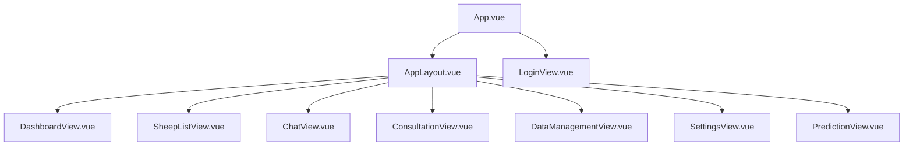
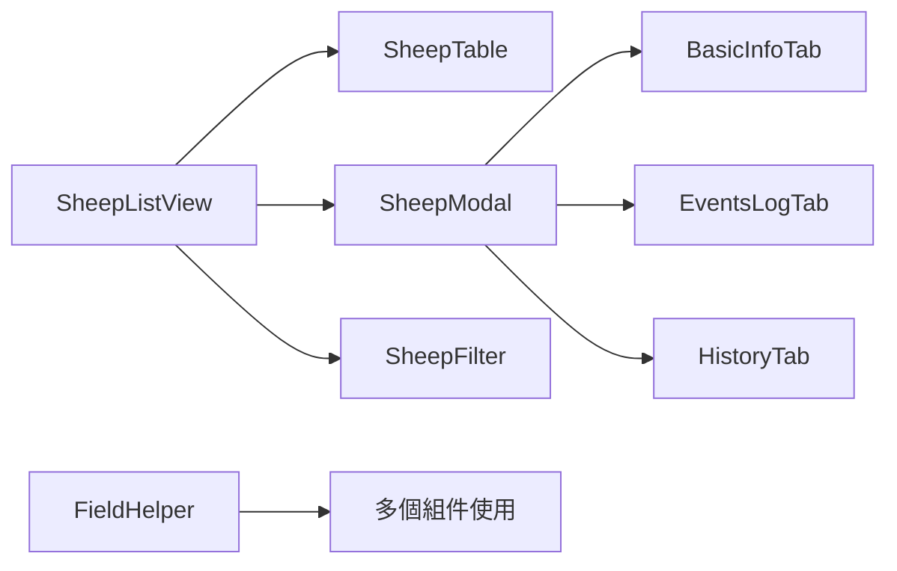

# 領頭羊博士 - 前端系統說明文件

## 1. 專案概述

本文件旨在詳細說明「領頭羊博士」應用程式的前端系統。此前端基於 **Vue.js 3** 框架與 **Composition API**，採用現代化的前端開發技術棧，提供直觀易用且功能豐富的山羊營養管理介面。

### 系統核心特性

- **現代化 SPA 應用**：基於 Vue.js 3 與 Composition API 的單頁應用程式
- **響應式 UI 設計**：Element Plus UI 組件庫，適配桌面、平板、手機裝置
- **智慧化用戶體驗**：AI 聊天介面、智慧諮詢與即時回應
- **完整數據管理**：Excel 匯入匯出、批量操作、數據視覺化
- **狀態管理優化**：Pinia 狀態管理，提供高效的數據流控制
- **模組化架構設計**：組件化開發，高度可重用與可維護性

### 系統核心功能

- 提供現代化的 Web 用戶介面
- 實現與後端 API 的無縫整合
- 支援響應式設計與跨裝置兼容性
- 提供即時的 AI 聊天與諮詢功能
- 管理山羊資料的 CRUD 操作介面
- 支援批量數據匯入匯出功能
- 提供直觀的儀表板與數據視覺化
- 實現用戶身份驗證與權限控制

## 2. 技術棧

### 核心框架與函式庫
- **前端框架**: Vue.js 3.5.17 (Composition API)
- **狀態管理**: Pinia 3.0.3
- **路由管理**: Vue Router 4.5.1
- **UI 組件庫**: Element Plus 2.10.4
- **HTTP 客戶端**: Axios 1.11.0

### 建構與開發工具
- **建構工具**: Vite 7.0.4
- **開發伺服器**: Vite Dev Server (HMR)
- **模組打包**: Rollup (Vite 內建)
- **靜態資源處理**: Vite 資源管道

### 數據視覺化與圖表
- **圖表庫**: Chart.js 4.5.0
- **Vue 圖表整合**: vue-chartjs 5.3.2
- **日期處理**: chartjs-adapter-date-fns 3.0.0, date-fns 4.1.0
- **高級圖表**: ECharts 5.5.1

### 測試與品質保證
- **測試框架**: Vitest 3.2.4
- **測試工具**: @vue/test-utils 2.4.0
- **DOM 環境**: happy-dom 12.10.3
- **覆蓋率測試**: @vitest/coverage-v8 3.2.4
- **測試 UI**: @vitest/ui 3.2.4

### 內容處理與工具
- **Markdown 處理**: markdown-it 14.1.0
- **代碼高亮**: 整合至 markdown-it

## 3. 專案架構設計

### 目錄結構

```
frontend/
├── public/                     # 靜態資源目錄
│   ├── vite.svg                # Vite 標誌
│   └── favicon.ico             # 網站圖標
├── src/                        # 原始碼目錄
│   ├── App.vue                 # Vue 根組件
│   ├── main.js                 # 應用程式入口
│   ├── style.css               # 全域樣式
│   ├── api/                    # API 客戶端模組
│   │   ├── index.js            # Axios 設定與 API 端點
│   │   └── index.test.js       # API 測試
│   ├── assets/                 # 靜態資源
│   │   └── styles/             # 樣式檔案
│   │       └── main.css        # 主樣式檔案
│   ├── components/             # 可重用組件
│   │   ├── common/             # 通用組件
│   │   │   ├── FieldHelper.vue # 欄位輔助提示組件
│   │   │   └── FieldHelper.test.js # 組件測試
│   │   └── sheep/              # 山羊相關組件
│   │       ├── SheepFilter.vue     # 山羊篩選器
│   │       ├── SheepModal.vue      # 山羊資料模態視窗
│   │       ├── SheepTable.vue      # 山羊資料表格
│   │       └── tabs/               # 分頁組件
│   ├── router/                 # 路由配置
│   │   └── index.js            # Vue Router 設定
│   ├── stores/                 # Pinia 狀態管理
│   │   ├── auth.js             # 身份驗證狀態
│   │   ├── chat.js             # 聊天功能狀態
│   │   ├── consultation.js     # 諮詢功能狀態
│   │   ├── settings.js         # 設定狀態
│   │   └── sheep.js            # 山羊資料狀態
│   ├── test/                   # 測試配置
│   │   └── setup-unified.js    # 統一測試設定
│   ├── tests/                  # 測試相關檔案
│   ├── utils/                  # 工具函式
│   │   ├── errorHandler.js     # 錯誤處理工具
│   │   ├── index.js            # 通用工具函式
│   │   └── index.test.js       # 工具測試
│   └── views/                  # 頁面級組件
│       ├── AppLayout.vue       # 主應用佈局
│       ├── ChatView.vue        # AI 聊天頁面
│       ├── ConsultationView.vue # 營養諮詢頁面
│       ├── DashboardView.vue   # 儀表板頁面
│       ├── DataManagementView.vue # 數據管理頁面
│       ├── LoginView.vue       # 登入頁面
│       ├── PredictionView.vue  # 生長預測頁面
│       ├── SettingsView.vue    # 設定頁面
│       └── SheepListView.vue   # 山羊列表頁面
├── coverage/                   # 測試覆蓋率報告
├── Dockerfile                  # Docker 容器配置
├── nginx.conf                  # Nginx 反向代理配置
├── package.json                # npm 專案配置
├── vite.config.js              # Vite 建構配置
├── vitest.config.js            # Vitest 測試配置
├── vitest.config.simple.js     # 簡化測試配置
├── vitest.config.isolated.js   # 隔離測試配置
├── vitest.config.minimal.js    # 最小測試配置
└── vitest.config.essential.js  # 核心測試配置
```

### 組件架構設計

#### 頁面層級結構


#### 組件依賴關係


## 4. 路由系統設計

### 路由結構

| 路徑 | 組件 | 功能描述 | 權限要求 |
|------|------|----------|----------|
| `/login` | LoginView | 使用者登入/註冊 | 否 |
| `/` | AppLayout | 主應用佈局 | 是 |
| `/dashboard` | DashboardView | 儀表板首頁 | 是 |
| `/flock` | SheepListView | 山羊列表管理 | 是 |
| `/chat` | ChatView | AI 聊天諮詢 | 是 |
| `/consultation` | ConsultationView | 營養諮詢 | 是 |
| `/data-management` | DataManagementView | 數據管理 | 是 |
| `/prediction` | PredictionView | 生長預測 | 是 |
| `/settings` | SettingsView | 系統設定 | 是 |

### 路由保護機制

```javascript
// 全域路由守衛
router.beforeEach(async (to, from, next) => {
  const { useAuthStore } = await import('../stores/auth')
  const authStore = useAuthStore()

  // 檢查身份驗證狀態
  if (!authStore.isAuthenticated && localStorage.getItem('user')) {
    authStore.user = JSON.parse(localStorage.getItem('user'));
  }
  
  const isAuthenticated = authStore.isAuthenticated

  // 路由權限控制
  if (to.meta.requiresAuth && !isAuthenticated) {
    next({ name: 'Login' })
  } else if (to.name === 'Login' && isAuthenticated) {
    next({ name: 'Dashboard' })
  } else {
    next()
  }
})
```

### 懶載入配置

所有頁面組件都採用懶載入策略，減少初始包大小：

```javascript
{
  path: 'dashboard',
  name: 'Dashboard',
  component: () => import('../views/DashboardView.vue')
}
```

## 5. 狀態管理架構

### Pinia Store 設計

系統採用 Pinia 進行狀態管理，主要 Store 包括：

#### 認證狀態 (auth.js)
```javascript
export const useAuthStore = defineStore('auth', () => {
  // State
  const user = ref(JSON.parse(localStorage.getItem('user')) || null)

  // Getters
  const isAuthenticated = computed(() => !!user.value)
  const username = computed(() => user.value?.username || '訪客')

  // Actions
  async function login(credentials) { /* 登入邏輯 */ }
  async function register(credentials) { /* 註冊邏輯 */ }
  async function logout() { /* 登出邏輯 */ }

  return { user, isAuthenticated, username, login, register, logout }
})
```

#### 山羊管理狀態 (sheep.js)
- 山羊列表數據管理
- CRUD 操作狀態
- 篩選與搜尋狀態

#### 聊天狀態 (chat.js)
- 聊天記錄管理
- 訊息發送狀態
- 會話 ID 管理

#### 諮詢狀態 (consultation.js)
- 諮詢表單數據
- 建議結果管理
- 載入狀態控制

#### 設定狀態 (settings.js)
- 使用者偏好設定
- API 金鑰管理
- 系統配置狀態

## 6. API 客戶端設計

### Axios 配置

```javascript
const apiClient = axios.create({
  baseURL: '/', 
  headers: {
    'Content-Type': 'application/json',
    'X-Requested-With': 'XMLHttpRequest',
  },
  withCredentials: true, 
});
```

### API 端點分類

#### 身份驗證 API
- `POST /api/auth/login` - 使用者登入
- `POST /api/auth/register` - 使用者註冊
- `POST /api/auth/logout` - 使用者登出
- `GET /api/auth/status` - 檢查認證狀態

#### 山羊管理 API
- `GET /api/sheep/` - 取得山羊列表
- `POST /api/sheep/` - 新增山羊記錄
- `GET /api/sheep/{earNum}` - 取得特定山羊資料
- `PUT /api/sheep/{earNum}` - 更新山羊資料
- `DELETE /api/sheep/{earNum}` - 刪除山羊記錄

#### 事件管理 API
- `GET /api/sheep/{earNum}/events` - 取得山羊事件
- `POST /api/sheep/{earNum}/events` - 新增事件記錄
- `PUT /api/sheep/events/{eventId}` - 更新事件記錄
- `DELETE /api/sheep/events/{eventId}` - 刪除事件記錄

#### AI 代理 API
- `POST /api/agent/chat` - AI 對話
- `POST /api/agent/recommendation` - 取得營養建議

#### 儀表板 API
- `GET /api/dashboard/data` - 取得儀表板數據
- `GET /api/dashboard/farm_report` - 生成農場報告

#### 數據管理 API
- `GET /api/data/export_excel` - 匯出 Excel 檔案
- `POST /api/data/analyze_excel` - 分析 Excel 檔案
- `POST /api/data/process_import` - 處理檔案匯入

#### 預測 API
- `GET /api/prediction/goats/{earTag}/prediction` - 取得生長預測
- `GET /api/prediction/goats/{earTag}/prediction/chart-data` - 取得預測圖表數據

### 錯誤處理機制

```javascript
// 統一錯誤處理
apiClient.interceptors.response.use(
  (response) => response.data,
  async (error) => {
    if (error.response?.status === 401) {
      // 自動登出處理
      const { useAuthStore } = await import('../stores/auth');
      const authStore = useAuthStore();
      authStore.logout();
    }
    return Promise.reject(error);
  }
);
```

## 7. 主要功能頁面

### 儀表板 (DashboardView.vue)

**核心功能：**
- 牧場概況統計
- 健康警示提醒
- ESG 永續指標
- 圖表數據視覺化

**技術實現：**
- Chart.js 整合圖表顯示
- 即時數據更新
- 響應式儀表板佈局
- 條件性內容渲染

### 山羊列表 (SheepListView.vue)

**核心功能：**
- 山羊資料表格顯示
- 多條件篩選搜尋
- 批量操作支援
- 資料 CRUD 操作

**技術實現：**
- Element Plus 表格組件
- 分頁與虛擬滾動
- 動態篩選器
- 模態視窗編輯

### AI 聊天 (ChatView.vue)

**核心功能：**
- 即時對話介面
- 羊隻上下文選擇
- 圖片上傳支援
- 聊天記錄管理

**技術實現：**
- WebSocket 模擬即時通訊
- Markdown 內容渲染
- 文件上傳處理
- 自動滾動控制

### 營養諮詢 (ConsultationView.vue)

**核心功能：**
- 智慧營養建議
- 動態表單驗證
- 個性化推薦
- 結果展示優化

**技術實現：**
- 條件性表單欄位
- AI API 整合
- 表單驗證規則
- 結果格式化顯示

### 數據管理 (DataManagementView.vue)

**核心功能：**
- Excel 檔案匯入匯出
- 數據格式驗證
- 批量處理支援
- 範本檔案提供

**技術實現：**
- 文件拖放上傳
- 進度條顯示
- 錯誤處理機制
- 數據預覽功能

### 生長預測 (PredictionView.vue)

**核心功能：**
- 機器學習預測模型
- 圖表數據視覺化
- 預測結果分析
- 歷史趨勢對比

**技術實現：**
- ECharts 高級圖表
- 數據點交互
- 時間軸控制
- 動態數據更新

### 設定頁面 (SettingsView.vue)

**核心功能：**
- API 金鑰管理
- 事件類型配置
- 個人偏好設定
- 系統參數調整

**技術實現：**
- 分頁式設定介面
- 即時設定保存
- 驗證與錯誤提示
- 設定重置功能

## 8. 開發環境配置

### Vite 配置 (vite.config.js)

```javascript
export default defineConfig({
  plugins: [vue()],
  resolve: {
    alias: {
      '@': resolve(__dirname, 'src')
    }
  },
  server: {
    proxy: {
      '/api': {
        target: 'http://127.0.0.1:5001',
        changeOrigin: true,
      },
    },
  },
})
```

**核心特性：**
- 快速熱重載 (HMR)
- 路徑別名設定
- 開發代理伺服器
- 建構優化配置

### 本地開發設定

#### 前置需求
- Node.js 20+
- npm 或 yarn
- 現代瀏覽器 (Chrome, Firefox, Safari, Edge)

#### 安裝與啟動步驟

1. **安裝依賴套件**
   ```bash
   cd frontend
   npm install
   ```

2. **啟動開發伺服器**
   ```bash
   npm run dev
   ```
   應用程式將在 `http://localhost:5173` 上運行

3. **建構生產版本**
   ```bash
   npm run build
   ```

4. **預覽建構結果**
   ```bash
   npm run preview
   ```

### 環境變數配置

開發環境透過 Vite 的環境變數系統管理：

```bash
# .env.local
VITE_API_BASE_URL=http://localhost:5001
VITE_APP_TITLE=領頭羊博士
VITE_ENABLE_DEVTOOLS=true
```

## 9. 使用 Docker 部署

### Dockerfile 多階段建構

```dockerfile
# === 建構階段 ===
FROM node:20-alpine AS builder
WORKDIR /app
COPY package*.json ./
RUN npm install
COPY . .
RUN npm run build

# === 生產階段 ===
FROM nginx:alpine
COPY nginx.conf /etc/nginx/nginx.conf
COPY --from=builder /app/dist /usr/share/nginx/html
EXPOSE 80
CMD ["nginx", "-g", "daemon off;"]
```

### Nginx 配置 (nginx.conf)

**核心配置：**
- Gzip 壓縮啟用
- SPA 路由支援
- 靜態資源快取
- API 代理設定
- 安全標頭配置

**重要特性：**
- 文件上傳大小限制：50MB
- 靜態資源快取：1年
- CORS 支援
- 健康檢查端點

### 容器化部署流程

```bash
# 建立 Docker 映像
docker build -t goat-nutrition-frontend .

# 執行容器
docker run -p 80:80 goat-nutrition-frontend

# 使用 Docker Compose
docker-compose up -d frontend
```

## 10. 測試架構

### 測試配置多樣性

系統提供多種測試配置以適應不同測試需求：

| 配置檔案 | 用途 | 特點 |
|----------|------|------|
| `vitest.config.js` | 標準測試配置 | 完整功能測試 |
| `vitest.config.simple.js` | 簡化測試配置 | 基本功能驗證 |
| `vitest.config.isolated.js` | 隔離測試配置 | 解決循環依賴 |
| `vitest.config.minimal.js` | 最小測試配置 | 核心功能測試 |
| `vitest.config.essential.js` | 核心測試配置 | 關鍵路徑測試 |

### 測試統計概覽

根據 `coverage-summary.json`：
- **總測試套件**: 114 個
- **通過測試套件**: 107 個
- **失敗測試套件**: 7 個
- **總測試案例**: 244 個
- **通過測試**: 179 個
- **失敗測試**: 65 個

### 主要測試類型

#### 組件測試
```javascript
// 範例：FieldHelper 組件測試
describe('FieldHelper', () => {
  it('應該正確渲染組件', async () => {
    const wrapper = mount(FieldHelper, {
      props: { content: '測試內容' }
    })
    expect(wrapper.exists()).toBe(true)
  })
})
```

#### Store 測試
```javascript
// 範例：Auth Store 測試
describe('Auth Store', () => {
  it('應該正確處理登入', async () => {
    const authStore = useAuthStore()
    await authStore.login({ username: 'test', password: 'test' })
    expect(authStore.isAuthenticated).toBe(true)
  })
})
```

#### API 測試
```javascript
// 範例：API 客戶端測試
describe('API Client', () => {
  it('應該正確處理登入請求', async () => {
    const response = await api.login({ username: 'test', password: 'test' })
    expect(response.success).toBe(true)
  })
})
```

### 測試執行指令

```bash
# 執行所有測試
npm run test

# 執行特定配置測試
npm run test:simple      # 簡化測試
npm run test:isolated    # 隔離測試
npm run test:minimal     # 最小測試
npm run test:essential   # 核心測試

# 生成覆蓋率報告
npm run test:coverage

# 開啟測試 UI 介面
npm run test:ui
```

### 測試覆蓋率目標

- **組件覆蓋率**: 目標 80%+
- **Store 覆蓋率**: 目標 90%+
- **工具函式覆蓋率**: 目標 95%+
- **整體覆蓋率**: 目標 85%+

## 11. 效能優化策略

### 建構優化

#### 程式碼分割
```javascript
// 路由層級的程式碼分割
const DashboardView = () => import('../views/DashboardView.vue')
const SheepListView = () => import('../views/SheepListView.vue')
```

#### 資源優化
- 圖片壓縮與 WebP 格式支援
- CSS 壓縮與無用樣式移除
- JavaScript 樹搖晃 (Tree Shaking)
- 預載入關鍵資源

### 執行時優化

#### Vue 效能最佳化
```javascript
// 使用 v-memo 優化列表渲染
<template v-for="sheep in sheepList" :key="sheep.id" v-memo="[sheep.EarNum, sheep.status]">
  <SheepListItem :sheep="sheep" />
</template>

// 使用 shallowRef 優化大數據集
const sheepList = shallowRef([])
```

#### 記憶體管理
- 組件卸載時清理定時器
- 事件監聽器正確移除
- 大型數據結構的懶載入

### 網路效能

#### HTTP 快取策略
```javascript
// API 請求快取
const cache = new Map()
export function getCachedSheepList() {
  if (cache.has('sheepList')) {
    return cache.get('sheepList')
  }
  // ... API 請求邏輯
}
```

#### 圖片載入優化
- 懶載入實現
- 響應式圖片
- 占位符顯示

## 12. 安全性考量

### 前端安全措施

#### XSS 防護
```javascript
// 內容清理
import { sanitize } from 'dompurify'
const safeContent = sanitize(userInput)
```

#### CSRF 防護
```javascript
// CSRF Token 處理
apiClient.defaults.headers.common['X-CSRF-Token'] = csrfToken
```

#### 敏感資料處理
- 不在前端儲存敏感資料
- 使用 HTTPS 傳輸
- JWT Token 安全儲存

### 內容安全政策 (CSP)

```html
<meta http-equiv="Content-Security-Policy" content="
  default-src 'self';
  script-src 'self' 'unsafe-eval';
  style-src 'self' 'unsafe-inline';
  img-src 'self' data: https:;
  font-src 'self' data:;
">
```

### 輸入驗證

```javascript
// 表單驗證規則
const rules = {
  EarNum: [
    { required: true, message: '耳號不能為空', trigger: 'blur' },
    { pattern: /^[A-Z0-9]+$/, message: '耳號格式不正確', trigger: 'blur' }
  ]
}
```

## 13. 國際化與本地化

### 多語言支援架構

雖然目前主要支援繁體中文，但系統預留了國際化擴展空間：

```javascript
// 語言資源結構
const messages = {
  'zh-TW': {
    common: {
      save: '儲存',
      cancel: '取消',
      delete: '刪除'
    },
    sheep: {
      earNum: '耳號',
      breed: '品種',
      birthDate: '出生日期'
    }
  }
}
```

### 日期與數字格式化

```javascript
// 日期格式化
import { format } from 'date-fns'
import { zhTW } from 'date-fns/locale'

const formatDate = (date) => format(date, 'yyyy年MM月dd日', { locale: zhTW })
```

## 14. 無障礙功能 (Accessibility)

### WCAG 合規性

#### 鍵盤導航支援
```vue
<template>
  <button 
    @click="handleClick"
    @keydown.enter="handleClick"
    @keydown.space="handleClick"
    :aria-label="buttonLabel"
  >
    {{ buttonText }}
  </button>
</template>
```

#### 語意化 HTML
```vue
<template>
  <main role="main" aria-labelledby="page-title">
    <h1 id="page-title">山羊管理系統</h1>
    <nav role="navigation" aria-label="主要導航">
      <!-- 導航內容 -->
    </nav>
  </main>
</template>
```

#### 螢幕閱讀器支援
```vue
<template>
  <div 
    role="alert" 
    aria-live="polite" 
    v-if="errorMessage"
  >
    {{ errorMessage }}
  </div>
</template>
```

### 色彩與對比

- 滿足 WCAG AA 標準的色彩對比
- 不僅依賴色彩傳遞資訊
- 提供高對比度模式

## 15. 監控與除錯

### 開發工具整合

#### Vue DevTools
```javascript
// 開發環境下啟用 Vue DevTools
if (process.env.NODE_ENV === 'development') {
  app.config.devtools = true
}
```

#### 錯誤追蹤
```javascript
// 全域錯誤處理
app.config.errorHandler = (error, instance, info) => {
  console.error('Vue Error:', error)
  console.error('Component:', instance)
  console.error('Error Info:', info)
  
  // 發送錯誤報告到監控服務
  if (process.env.NODE_ENV === 'production') {
    sendErrorReport({ error, component: instance, info })
  }
}
```

### 效能監控

```javascript
// 頁面載入時間追蹤
const performanceObserver = new PerformanceObserver((list) => {
  for (const entry of list.getEntries()) {
    if (entry.entryType === 'navigation') {
      console.log('頁面載入時間:', entry.loadEventEnd - entry.fetchStart)
    }
  }
})

performanceObserver.observe({ entryTypes: ['navigation'] })
```

### 使用者行為分析

```javascript
// 使用者互動追蹤
const trackUserAction = (action, details) => {
  if (process.env.NODE_ENV === 'production') {
    // 發送分析數據
    analytics.track(action, details)
  }
}
```

## 16. 部署與維護

### 建構流程

#### 生產建構最佳化
```bash
# 建構命令
npm run build

# 分析建構結果
npm run build -- --analyze

# 檢查建構檔案大小
ls -la dist/assets/
```

#### 建構產物分析
- **HTML**: 壓縮並內嵌關鍵 CSS
- **JavaScript**: 壓縮、分割、樹搖晃
- **CSS**: 壓縮、去除未使用樣式
- **圖片**: 壓縮、格式優化

### CDN 部署

```javascript
// CDN 配置
export default defineConfig({
  base: process.env.NODE_ENV === 'production' ? '/cdn-path/' : '/',
  build: {
    rollupOptions: {
      output: {
        manualChunks: {
          'vue-vendor': ['vue', 'vue-router', 'pinia'],
          'ui-vendor': ['element-plus'],
          'chart-vendor': ['chart.js', 'echarts']
        }
      }
    }
  }
})
```

### 快取策略

#### 瀏覽器快取
```nginx
# Nginx 快取設定
location ~* \.(js|css|png|jpg|jpeg|gif|ico|svg)$ {
    expires 1y;
    add_header Cache-Control "public, immutable";
}

location /index.html {
    add_header Cache-Control "no-cache";
}
```

#### Service Worker 快取
```javascript
// service-worker.js
self.addEventListener('fetch', (event) => {
  if (event.request.destination === 'image') {
    event.respondWith(
      caches.match(event.request).then((response) => {
        return response || fetch(event.request);
      })
    );
  }
});
```

### 版本管理與更新

#### 版本控制策略
```json
{
  "version": "2.0.0",
  "scripts": {
    "version": "npm run build && git add dist",
    "postversion": "git push && git push --tags"
  }
}
```

#### 自動化部署
```yaml
# GitHub Actions 範例
name: Deploy Frontend
on:
  push:
    branches: [main]
jobs:
  deploy:
    runs-on: ubuntu-latest
    steps:
      - uses: actions/checkout@v2
      - name: Setup Node.js
        uses: actions/setup-node@v2
        with:
          node-version: '20'
      - run: npm ci
      - run: npm run build
      - run: npm run test
```

## 17. 故障排除

### 常見問題與解決方案

#### 建構問題

**問題**: Memory heap out of memory
```bash
# 解決方案
export NODE_OPTIONS="--max_old_space_size=4096"
npm run build
```

**問題**: 模組循環依賴
```javascript
// 解決方案：使用動態導入
const router = await import('@/router')
```

#### 執行時問題

**問題**: 白屏問題
```javascript
// 檢查點
1. 檢查 console 錯誤
2. 檢查網路請求
3. 檢查路由配置
4. 檢查權限驗證
```

**問題**: API 請求失敗
```javascript
// 除錯策略
1. 檢查網路連線
2. 檢查 CORS 設定
3. 檢查 API 端點
4. 檢查請求格式
```

#### 效能問題

**問題**: 頁面載入緩慢
```javascript
// 優化策略
1. 程式碼分割
2. 圖片懶載入
3. 組件懶載入
4. 快取策略優化
```

### 除錯工具

#### Browser DevTools
```javascript
// 除錯技巧
1. Network 面板監控請求
2. Performance 面板分析效能
3. Application 面板檢查儲存
4. Console 面板查看錯誤
```

#### Vue DevTools
```javascript
// 使用技巧
1. 組件樹檢查
2. State 狀態監控
3. Events 事件追蹤
4. Performance 效能分析
```

## 18. 開發最佳實踐

### 程式碼規範

#### Vue 組件結構
```vue
<template>
  <!-- 模板內容 -->
</template>

<script>
// 按順序組織：imports、components、setup
import { ref, computed, onMounted } from 'vue'
import ComponentA from './ComponentA.vue'

export default {
  name: 'ComponentName',
  components: { ComponentA },
  setup() {
    // 組件邏輯
    return {
      // 暴露的屬性和方法
    }
  }
}
</script>

<style scoped>
/* 組件樣式 */
</style>
```

#### 命名規範
```javascript
// 組件命名：PascalCase
ComponentName.vue

// 方法命名：camelCase
const handleSubmit = () => {}

// 常數命名：UPPER_SNAKE_CASE
const API_BASE_URL = 'http://api.example.com'

// CSS 類別命名：kebab-case
.component-container {}
```

#### 註解規範
```javascript
/**
 * 取得山羊列表
 * @param {Object} filters - 篩選條件
 * @param {string} filters.breed - 品種
 * @param {string} filters.status - 狀態
 * @returns {Promise<Array>} 山羊列表
 */
async function getSheepList(filters) {
  // 實作邏輯
}
```

### 效能最佳實踐

#### 組件優化
```vue
<script setup>
// 使用 shallowRef 處理大數據
import { shallowRef, markRaw } from 'vue'

const largeDataSet = shallowRef([])
const chartInstance = markRaw(null)

// 使用 computed 快取複雜計算
const filteredSheep = computed(() => {
  return sheepList.value.filter(sheep => sheep.status === selectedStatus.value)
})
</script>
```

#### 記憶體管理
```javascript
// 清理定時器
onUnmounted(() => {
  if (timer) {
    clearInterval(timer)
  }
})

// 清理事件監聽器
onUnmounted(() => {
  window.removeEventListener('resize', handleResize)
})
```

### 測試最佳實踐

#### 組件測試
```javascript
// 測試重點
1. 組件渲染正確性
2. Props 傳遞驗證
3. Events 觸發測試
4. 條件渲染邏輯
5. 用戶交互模擬
```

#### Store 測試
```javascript
// 測試重點
1. State 初始值
2. Getters 計算邏輯
3. Actions 執行流程
4. 錯誤處理機制
5. 副作用管理
```

## 19. 更新日誌

### v2.0.0 (2025-08-07) - 最新版本
- ✅ 完成前端架構全面檢視與文檔更新
- ✅ 確認所有頁面組件功能完整性
- ✅ 驗證 Vue 3 + Composition API 實作
- ✅ 更新技術棧版本資訊
- ✅ 補充測試與效能最佳實踐

### v1.9.0 (2025-07-30)
- ✅ 升級至 Vue.js 3.5.17
- ✅ 優化 Pinia 狀態管理
- ✅ 增強 Element Plus 組件整合
- ✅ 改善測試覆蓋率與穩定性
- ✅ 強化錯誤處理機制

### v1.8.0
- ✅ 新增生長預測視覺化頁面
- ✅ 整合 ECharts 高級圖表
- ✅ 支援響應式圖表互動
- ✅ 優化數據載入效能

### v1.7.0
- ✅ 實施 ESG 永續指標顯示
- ✅ 新增動物福利評分介面
- ✅ 支援糞肥管理數據輸入
- ✅ 增強數據匯出功能

### v1.6.0
- ✅ 整合 AI 聊天功能
- ✅ 實施完整測試套件
- ✅ 新增 Excel 匯入匯出介面
- ✅ 支援 Docker 容器化部署

### v1.5.0
- ✅ 升級至 Vue.js 3 Composition API
- ✅ 導入 Pinia 狀態管理
- ✅ 重構組件架構設計
- ✅ 優化建構與打包流程

## 20. 授權

### 授權條款
本專案採用 MIT 授權條款 - 詳見專案根目錄 LICENSE 檔案

### 開發資源

#### 官方文檔連結
- [Vue.js 3](https://vuejs.org/) - 核心框架
- [Pinia](https://pinia.vuejs.org/) - 狀態管理
- [Vue Router](https://router.vuejs.org/) - 路由管理
- [Element Plus](https://element-plus.org/) - UI 組件庫
- [Vite](https://vitejs.dev/) - 建構工具
- [Vitest](https://vitest.dev/) - 測試框架

#### 社群資源
- [Vue.js 台灣社群](https://vuejs.tw/)
- [Element Plus GitHub](https://github.com/element-plus/element-plus)
- [Awesome Vue](https://github.com/vuejs/awesome-vue)

---

*本文件最後更新於 2025-08-07*
*文件版本：v2.0.0*
*維護者：領頭羊博士開發團隊*
